<h1>카카오 테크 캠퍼스 2단계 FE 과제: 카카오 쇼핑하기</h1>

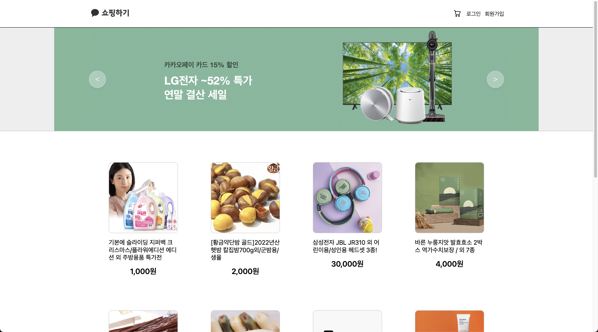

<br />

## 🏁 시작하기

파일을 저장한 후 다음의 명령어로 직접 프로젝트를 실행할 수 있습니다.

```zsh
npm install
npm start
```

<br />

## 🧐 프로젝트 소개

개발 기간 : 2023년 6월 26일 ~ 8월 3일

🎉 FE 우수작으로 선정되었습니다.

카카오 테크 캠퍼스(이하 카테캠) 2단계 FE 과제 수행 프로젝트입니다.

프로젝트는 카테캠 레포지토리에 PR을 보내고, 현업자에게 멘토링과 코드 리뷰를 받으며 진행했습니다.

리액트를 사용한 사실상의 첫 프로젝트이며 리액트를 공부하고, 다양한 라이브러리를 사용해보는 시간을 가졌습니다.

\+ 아토믹 패턴의 폴더 구조를 가집니다.

```
라이브러리 선택 이유

✔️ react-hook-form
회원가입, 로그인을 위해 react-hook-form을 사용했습니다.
react-hook-form은 비제어 컴포넌트의 장점을 살리면서 제어 컴포넌트처럼 실시간성을 제공합니다.

✔️ redux
로그인 상태를 전역적으로 파악하기 위해 redux tool kit을 사용했습니다.
로컬스토리지에 로그인 유무를 token으로 저장합니다.

✔️ axios, react-query
통신을 위해 axios, react-query를 사용했습니다.
axios는 fetch와 비교하여 timeout, 인터셉터, JSON 데이터를 반환 등 다양한 기능을 제공합니다.
react-query는 데이터페칭을 편하게 관리할 수 있는 기능을 제공합니다.

✔️ styled-components, ant design, react spinners
전체적인 css 작업을 위해 styled-components를 사용했습니다.
3주차, 4주차 과제에서 UI 라이브러리를 사용해보라는 요구가 있어 ant design과 react spinners를 사용해보았습니다.

✔️ puppeteer
결제 프로세스(로그인 -> 장바구니 담기 -> 결제 -> 로그아웃)를 테스팅하기 위해 puppeteer을 사용했습니다.
크롬 개발자 도구 recorder를 사용하면 테스트 코드를 직접 작성하지 않아도 된다는 장점이 있습니다.
```

### 기능

- 회원가입
- 로그인
- 로그아웃
- 전체 상품 목록 조회
- 개별 상품 상세 조회
- 상품 옵션 선택
- 옵션 확인 및 수량 선택
- 장바구니 담기
- 장바구니 상품 목록 조회
- 장바구니 상품 옵션 확인 및 수량 선택
- 장바구니 상품 주문
- 주문 상품 결제
- 주문 결과 확인

### 목적

- 과제 수행

### 회고

맨땅에 헤딩하기였던 나의 프로젝트.

프로젝트를 진행하면서 깨달은 점과 앞으로의 다짐(방향?)을 정리하고자 한다.

1️⃣ 설계의 중요성

코딩을 시작하기 전에, 프로젝트가 어떤 구조를 가질지 미리 설계하는 것이 중요하다는 것을 알게 되었다.

라우터를 다루거나 컴포넌트를 만들 때 큰 틀을 생각해보지 않았기 때문에 필요할 때마다 갖다붙이는 식의 어글리한 코드를 작성한 듯..

라우터의 예시로, 다음부터는 [auth 처리와 리다이렉트를 담당하는 컴포넌트를 하나 만들어서 래핑 해주는 방법](https://blog.logrocket.com/complete-guide-authentication-with-react-router-v6/#using-nested-routes-and-outlet)으로 처리할 수 있겠다.

2️⃣ 컴포넌트의 재사용성과 확장성

컴포넌트를 만들 때 화면에 어떻게 배치될지 너무 구체적으로 작성하면 재사용성이 떨어진다.

추가적인 스타일이 필요한 경우 오버라이딩될 수 있게 만들자.

절대 바뀌지 않을 부분과 그렇지 않을 부분을 명확하게 구분하여 합성 컴포넌트에 익숙해지자.

3️⃣ 폴더 구조

점점 코드가 쌓일수록 아토믹 패턴에 대해 불편함을 느꼈다.

-> atoms, molecules 등 단계를 나눌 때마다 애매하여 판단의 어려움이 있었다.

-> 컴포넌트가 많아질수록 컴포넌트를 구분하기 위해 이름이 길어지고, 사용할 컴포넌트를 찾는 데 어려움이 있었다.

물론 사용하면서 느끼는 장점도 있었기에, 선택적으로 수용하여 폴더 구조에 대한 주관을 가지려고 한다.

다음 프로젝트는 다음과 같은 구조를 사용해볼까 생각한다. 계속 고쳐나갈 듯!

```
my-app
├── node_modules
├── public
│   ├── index.html
│   ├── favicon.ico
│   └── manifest.json
├── src
│   ├── api
│   │   ├── index.js
│   │   └── ... (다른 API 관련 파일들)
│   ├── components
│   │   ├── CommonComponent1
│   │   ├── CommonComponent2
│   │   └── ... (다른 공통 컴포넌트들)
│   ├── lib
│   │   ├── index.js
│   │   └── ... (다른 라이브러리 관련 파일들)
│   ├── pages
│   │   ├── Page1
│   │   │   ├── components
│   │   │   │   ├── Page1Component1
│   │   │   │   ├── Page1Component2
│   │   │   │   └── ... (다른 페이지 1의 컴포넌트들)
│   │   │   └── Page1.js (or Page1.jsx)
│   │   ├── Page2
│   │   │   ├── components
│   │   │   │   ├── Page2Component1
│   │   │   │   ├── Page2Component2
│   │   │   │   └── ... (다른 페이지 2의 컴포넌트들)
│   │   │   └── Page2.js (or Page2.jsx)
│   │   └── ... (다른 페이지들)
│   ├── utils
│   │   ├── index.js
│   │   └── ... (다른 유틸리티 함수들)
│   ├── App.js
│   ├── index.js
│   └── ...
├── package.json
├── package-lock.json
└── ...
```

4️⃣ 최적화 관련 고민

리액트에 대한 이해가 부족한 상태로 코딩을 시작했기 때문에 프로젝트가 기능의 구현에 초점이 맞춰져 있다.

다음부터는 Suspense와 lazy를 사용하여 코드 스플리팅을 시도할 수 있겠다.

5️⃣ 적응형 웹 디자인

현재 프로젝트는 가로 화면의 컴퓨터에서만 나의 의도대로 보일 것 같다.

앞으로 브라우저와 디바이스에 따라 적응형 웹으로 만들어보자.

6️⃣ form 유효성 검사

form의 유효성 검사와 UI 관련하여 적절한 가이드 메시지, 유효성 검사 시기(ex. blur) 등 굉장히 많은 선택지가 있다는 것을 알게 되었다.

사용자에게 최적의 UX를 제공하기 위해 많은 고민이 필요할 듯하다.

7️⃣ 에러 캐칭

에러 상황을 파악하고 사용자에게 그에 따른 가이드를 제시해야 한다.

에러 캐칭이 사용자 경험과 가장 크게 직결되는 부분이라고 생각이 들었다.

지금은 alert로 에러를 안내하지만, toast나 modal을 사용하는 것이 UI/UX 상 이점이 크게 작용할 것 같다.

<br />

## ⚙️ 기술 스택

### Config


### Development

<div style="display: flex; gap: 4px;">
  
  
  
  
  
  
  
  
  
  
</div>

<br />

<h1>주차별 과제 내용</h1>

<details>
<summary>Step-2.-Week-1</summary>
<div>
  
## 카카오 테크 캠퍼스 2단계 - FE - 1주차 클론 과제

</br>

## **과제명**

```
1. 쇼핑몰 웹사이트 탐색을 통한 페이지 구성
2. UI 컴포넌트의 명칭과 사용법 익히기
```

</br>

## **과제 설명**

✅ **과제 1.**

```

쇼핑몰 웹사이트를 탐색해 어떠한 페이지 구성을 가지고 있는지 체크합니다.
대부분의 쇼핑몰은 다음의 페이지 구성을 가지고 있습니다.

- 메인 페이지
- 상품 검색 결과 페이지
- 개별 상품 상세 페이지
- 주문 목록 페이지
- 결제 페이지
- 결제 완료 페이지
- 장바구니 페이지
- ...

이와 같이 위의 서비스가 동작하는데 필수적인 페이지가 무엇이 있고, 해당 페이지에서 어떠한 기능이 구현되어야 하는지 작성하세요.
그리고 어떠한 디렉터리 구조로 프로젝트를 진행할지 작성해주세요. (README.md 파일에 작성)
```

### 페이지별 구성

<table>
  <tr>
    <th>페이지</th>
    <th>핵심 기능</th>
    <th>기능 상세 설명</th>
    <th>인터페이스</th>
  </tr>
  <tr>
    <td>(기능 1)<br />메인</td>
    <td>1. GNB<br />2. Carousel<br />3. 전체 상품 목록 조회</td>
    <td>
      사이트에 접속했을 때 가장 먼저 보이는 화면이다.<br />
      1. GNB는 화면 상단에 고정하여 위치하고 홈(전체 상품 목록 조회), 장바구니&결제, 로그인으로 구성된다.<br />
      2. Carousel은 GNB의 하단에 위치하고 특가와 같은 이벤트를 보여주기 위해 6개의 슬라이드로 구성된다.<br />
      3. 전체 상품 목록 조회는 Carousel의 하단에 위치하고 상품 목록을 나열한다.
    </td>
    <td>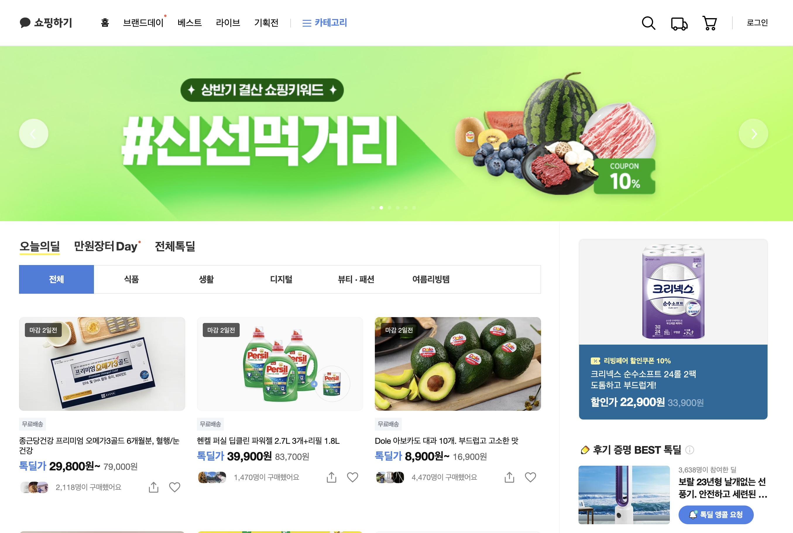</td>
  </tr>
  <tr>
    <td>(기능 2)<br />회원 가입</td>
    <td>서비스 이용을 위한 회원 가입</td>
    <td>
      1. 가입을 위해 이메일, 이름, 비밀번호가 필요하다.<br />
      2. 이메일 유효성 검사(영문+숫자@영문+숫자.영문+숫자)<br />
      3. 비밀번호 유효성 검사(공백없이 영문, 특수문자, 숫자 포함 8~20자)
    </td>
    <td></td>
  </tr>
  <tr>
    <td>(기능 3)<br />로그인</td>
    <td>회원 서비스를 이용하기 위한 로그인</td>
    <td>
      1. 이메일/비밀번호 입력 후 로그인 버튼 클릭 시, 유효성 검사<br />
      2. 에러 발생 시 입력창 하단에 에러메시지 출력<br />
      3. 유효한 경우 로그인
    </td>
    <td>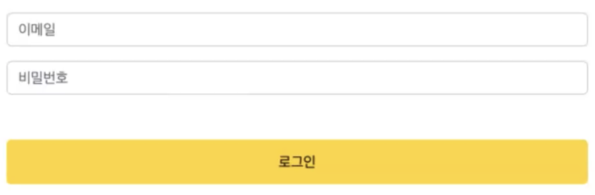</td>
  </tr>
  <tr>
    <td>(기능 4)<br />로그아웃</td>
    <td>로그아웃 및 회원 서비스 종료</td>
    <td>
      1. GNB의 오른쪽에 위치한 로그아웃 버튼 클릭 시, 로그아웃
    </td>
    <td>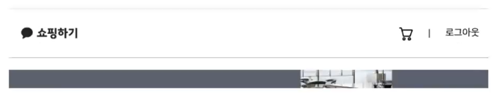</td>
  </tr>
  <tr>
    <td>(기능 5)<br />전체 상품 목록 조회</td>
    <td>전체 상품 조회 및 화면 출력</td>
    <td>
      1. 전체 상품 조회 API를 통해 상품 목록을 가져온다.<br />
      2. 상품 이미지, 상품명, 가격 정보를 화면에 출력한다.
    </td>
    <td>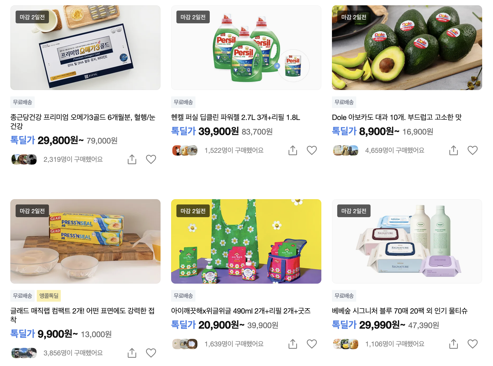</td>
  </tr>
  <tr>
    <td>(기능 6)<br />개별 상품 상세 조회</td>
    <td>상품 선택 시, 해당 상품에 대한 정보 출력</td>
    <td>
      1. 전체 상품 목록에서 특정 상품 카드를 클릭하면 상세 상품 조회와 옵션 조회 API를 통해 해당 상품에 대한 상세 정보와 옵션을 가져와 화면에 출력한다.
    </td>
    <td>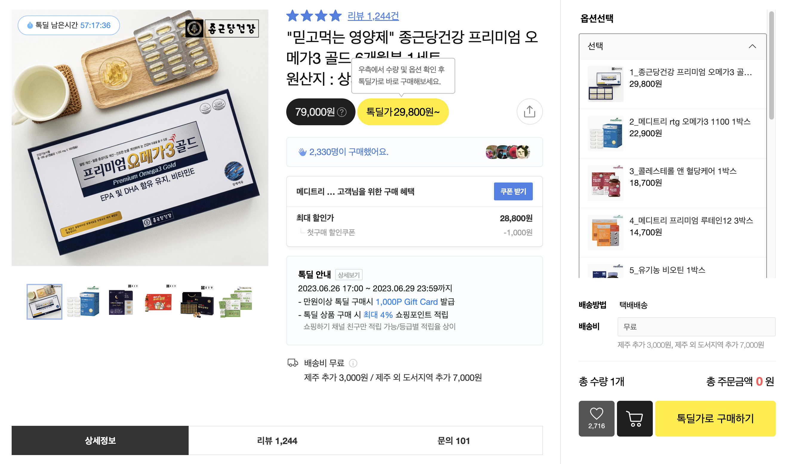</td>
  </tr>
  <tr>
    <td>(기능 7)<br />옵션 선택</td>
    <td>상품 상세 페이지에서 상품 옵션 선택</td>
    <td>
      1. 상품 옵션을 선택한다.<br />
      2. 선택된 옵션을 다시 선택할 수 없다.(수량으로 조절)<br />
      3. 여러 옵션을 선택할 수 있다.
    </td>
    <td>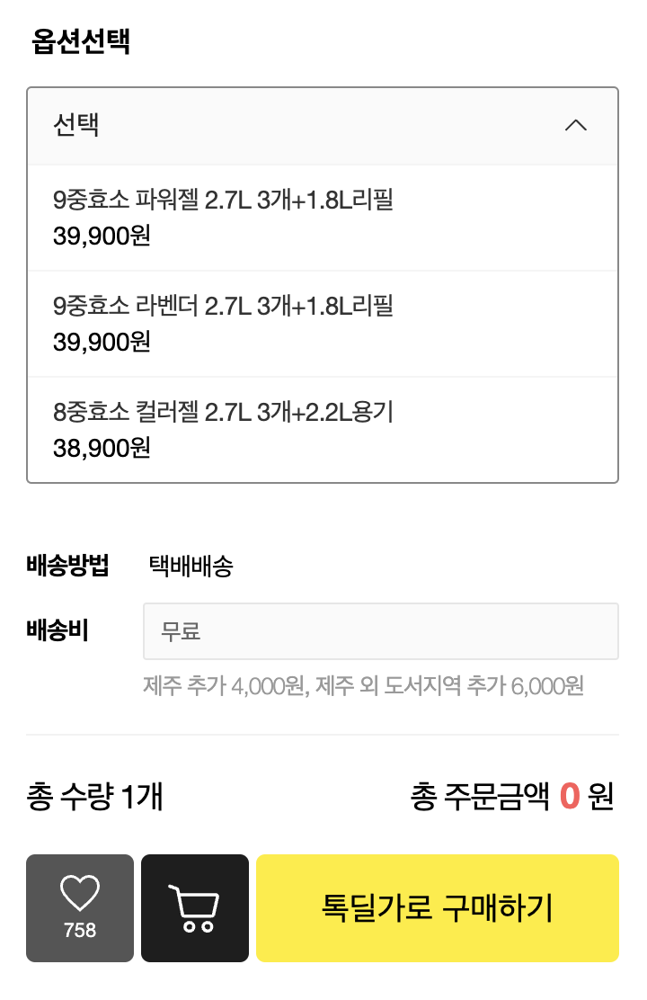</td>
  </tr>
  <tr>
    <td>(기능 8)<br />옵션 확인</td>
    <td>상품 상세 페이지에서 옵션과 수량 확인</td>
    <td>
      1. 선택한 옵션을 확인하고 수량을 결정한다.<br />
      2. 옵션별 -/+ 버튼을 통해 수량을 조절할 수 있다.<br />
      3. 옵션과 수량에 따라 금액이 출력된다.
    </td>
    <td>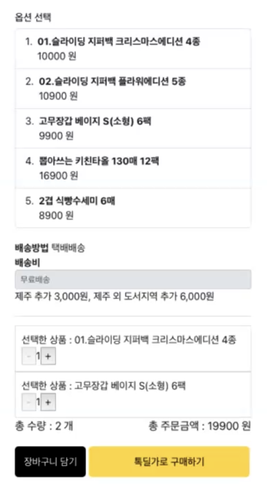</td>
  </tr>
  <tr>
    <td>(기능 9)<br />장바구니 담기</td>
    <td>상품 상세 페이지에서 장바구니에 상품 담기</td>
    <td>
      1. 옵션/수량 선택 후 장바구니 담기 클릭 시, 데이터를 서버에 전달하고 장바구니에 저장한다.<br />
      2. "장바구니에 담겼습니다." 문구를 팝업으로 안내한다.
    </td>
    <td></td>
  </tr>
  <tr>
    <td>(기능 10)<br />장바구니 보기</td>
    <td>장바구니에 담긴 상품 데이터 확인 및 수량 조절</td>
    <td>
      1. 장바구니에 담긴 상품 데이터(이미지, 상품명, 옵션, 가격)를 출력한다.<br />
      2. 옵션과 수량을 변경할 수 있으며 그에 따른 가격을 출력한다.<br />
      3. 주문하기 버튼 클릭 시, 주문/결제 화면으로 이동한다.
    </td>
    <td>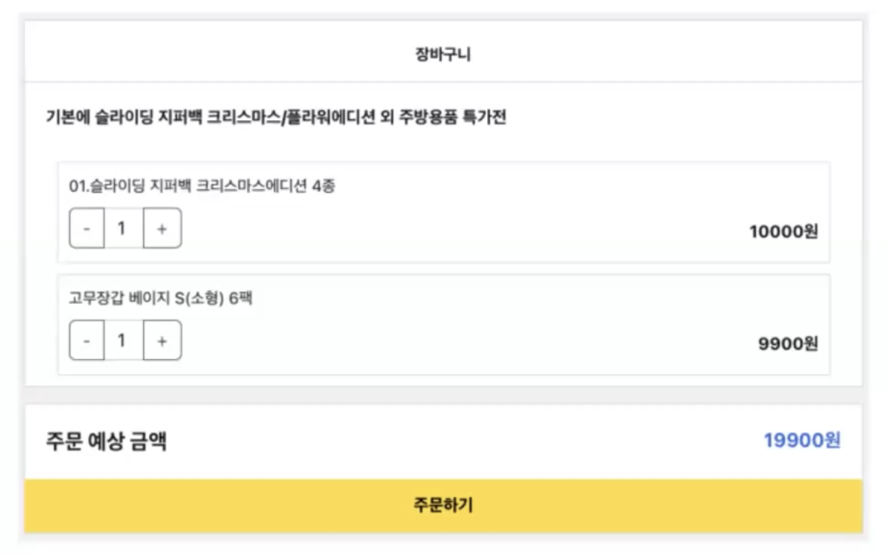</td>
  </tr>
  <tr>
    <td>(기능 11)<br />주문 및 결제</td>
    <td>실제 결제 절차 없이 상품 주문/결제 처리</td>
    <td>
      1. 주문할 상품 데이터(상품명, 옵션, 수량, 가격)를 출력한다.<br />
      2. 구매 조건 확인 및 결제 진행 동의, 개인정보 제3자 제공 동의를 체크박스로 입력받는다.<br />
      3. 결제하기 버튼 클릭 시, 실제 결제 절차 없이 상품을 주문한 것으로 처리한다.
    </td>
    <td>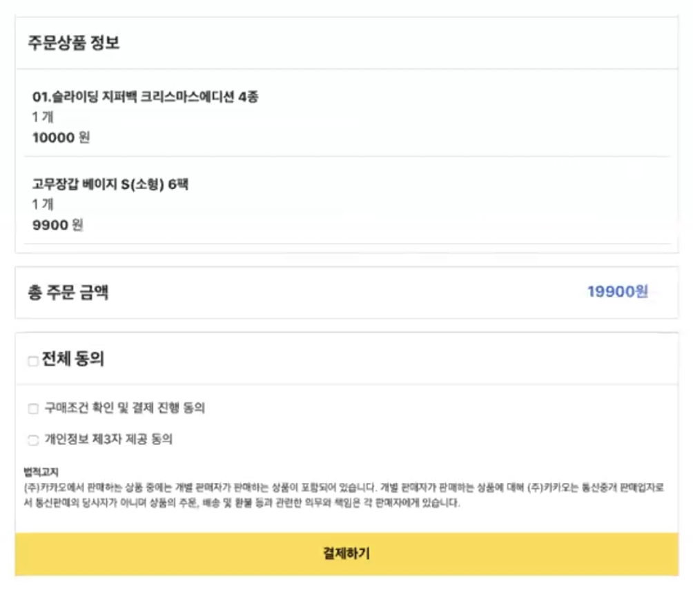</td>
  </tr>
  <tr>
    <td>(기능 12)<br />주문 결과 확인</td>
    <td>결제 성공 시, 주문 상품에 대한 결과 출력</td>
    <td>
      1. 주문 상품 정보(상품명, 주문번호, 옵션, 수량, 가격)을 출력한다.<br />
      2. 구매 조건 확인 및 결제 진행 동의, 개인정보 제3자 제공 동의를 체크박스로 입력받는다.
    </td>
    <td>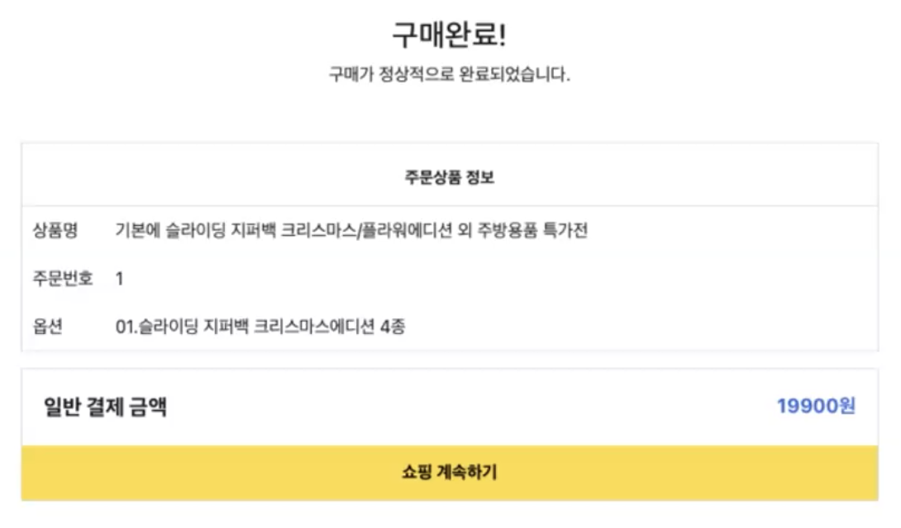</td>
  </tr>
</table>

### 디렉터리 구조

```
/my-app
├── /node_modules : 프로젝트에 필요한 라이브러리가 설치된 폴더
├── /public : index.html를 포함한 실제 서버에 배포되는 폴더
├── /src : 리액트로 작성되는 파일들을 담은 폴더
├── .gitignore : 깃으로 추적하지 않을 파일이나 폴더를 입력할 수 있는 파일
├── package.json : 프로젝트의 이름, 버전, 라이브러리들의 목록 등이 포함된 파일
└── README.md : 프로젝트의 설명을 작성할 수 있는 파일

/src
├── /assets : 이미지나 폰트를 저장하는 폴더
├── /apis : API 관련 값들을 저장하는 폴더
├── /components : 재사용 가능한 컴포넌트를 모아놓는 폴더
├── ...
├── App.js : 리액트의 루트 요소
└── index.js : 코드 진입

구글링을 통해 디렉터리 구조에 관한 많은 이야기들을 찾을 수 있었는데..
정확하게 이해한 것만 정리했다.
앞으로 공부하면서 더 많은 것들을 이해하도록 하자!
```

</br>

✅ **과제 2.**

```
프론트 개발자가 다른 프론트 개발자와 소통 및 UI 디자이너와 소통하는데 필수적인 UI 컴포넌트의 명칭과 사용법을 익힙니다.
수업시간에 배운 컴포넌트의 명칭과 사용법 이외에 대표적인 UI 라이브러리 홈페이지를 조사해보면 수많은 컴포넌트가 어떤식으로 동작하는지 확인할 수 있습니다.
리액트 프로젝트를 생성하고, 토스트, 브래드크럼, 캐러셀, 라디오버튼, 토글버튼, 체크리스트를 UI 라이브러리가 아닌 자신만의 방식으로 스타일링하고 상태 관리를 적용해 코드를 작성하세요.
작성된 코드는 레퍼지토리에 업로드하여 멘토님에게 전달해주세요.
```

✅ **과제 3.**

```
각 컴포넌트를 시현해 볼 수 있는 페이지를 만드세요.
하나의 페이지에 모든 컴포넌트를 둬도 좋고, 각 페이지별로 분리해도 괜찮습니다.
```

### 개발 환경

```bash
npx create-react-app my-app
```

& styled-components 라이브러리

### 느낀 점

```
라이브러리 없이 직접 다 구현하는 게 굉장히 어려운 일이구나..
```

### 질문

```
- 토스트
Q1. 실제로 토스트 메시지를 띄울 때는 Portal의 개념을 사용할 것 같은데 맞나요?

- 브래드크럼
Q2. Breadcrumb 안의 마지막 BreadcrumbItem 요소에 직접 클래스를 주어 색을 입히는 방법 이외에,
    자동으로 마지막 요소를 파악하고 그 요소에 색을 입히려면 어떻게 해야하는지 궁금합니다.

- 캐러셀
Q3. 제 캐러셀은 첫 슬라이드와 마지막 슬라이드의 이동이 부자연스럽습니다.
    원하는 자연스러운 이동은 마지막 슬라이드에서 다음 화면으로 넘길 시 화면이 오른쪽으로 넘어가 첫 슬라이드를 보여주는 것인데,
    이 방법이 궁금합니다.

- 라디오버튼
Q4. 제 라디오버튼은 재사용성이 낮은 것으로 생각되는데, 어떤 식으로 코드를 작성하는게 재사용성을 높일 수 있나요?

- 체크리스트
Q5. Context API를 사용하여 체크리스트를 만들고 싶었습니다.
    그러나, 제 생각만으로는 구현이 어려워 구글링을 통해 코드를 분석하는 식으로 코딩했습니다.
    앞으로의 과제에선 이런 방법은 지양해야 할까요?
```

</br>

## **과제 상세 : 수강생들이 과제를 진행할 때, 유념해야할 것**

```
1. README.md 파일은 동료 개발자에게 프로젝트에 쉽게 랜딩하도록 돕는 중요한 소통 수단입니다.
해당 프로젝트에 대해 아무런 지식이 없는 동료들에게 설명하는 것처럼 쉽고, 간결하게 작성해주세요.

2. 좋은 개발자는 디자이너, 기획자, 마케터 등 여러 포지션에 있는 분들과 소통을 잘합니다.
UI 컴포넌트의 명칭과 이를 구현하는 능력은 필수적인 커뮤니케이션 스킬이자 필요사항이니 어떤 상황에서 해당 컴포넌트를 사용하면 좋을지 고민하며 코드를 작성해보세요.
```

</br>

## **코드리뷰 관련: PR시, 아래 내용을 포함하여 코멘트 남겨주세요.**

**1. PR 제목과 내용을 아래와 같이 작성 해주세요.**

> - PR 제목 : 부산대FE\_라이언\_1주차 과제

</br>

</div>
</details>

---

<details>
<summary>Step-2.-Week-2</summary>
<div>

## 카카오 테크 캠퍼스 2단계 - FE - 2주차 클론 과제

</br>

## **과제명**

```
1. 코드 디자인 패턴과 상태 관리
```

</br>

## **과제 설명**

✅**과제 1. 아토믹 컴포넌트 디자인 패턴 사용**

```
- 회원가입, 로그인 페이지 개발에 필요한 컴포넌트를 아토믹 디자인 패턴을 사용해 작성하세요.
- 작성한 컴포넌트는 사용의 편의성을 위해 Props에 적절한 주석을 달아주세요.
```

</br>

✅**과제 2. 회원 가입, 로그인 페이지 개발**

```
- 백엔드 API 문서를 참고하여 회원가입, 로그인 페이지를 개발하세요.
- 각 페이지에는 적합한 값이 입력되도록 하고, 적절하지 않은 값이 들어온 경우 API 요청을 보내기 전에 프론트에서 에러 캐칭을 해주세요.
- 회원가입, 로그인 후에는 메인 페이지로 리다이렉트하세요.
- API 응답 과정에서 로그인이 실패하는 경우, 회원가입이 실패한 경우에 대해서 에러 캐칭도 적용해야 합니다.
```

</br>

✅**과제 3. 상태관리 모듈 적용**

```
- 로그인 후에 사용자의 정보를 상태관리 모듈을 하나 선정해 저장하고 불러올 수 있도록 코드를 작성하세요.
- 사용자가 로그인 상태일 때는 GNB 영역에 로그인 버튼이 보이면 안됩니다.
- 로그아웃시 상태를 초기화하세요.
- 새로고침 시에도 상태를 잃지 않고 유지해야 합니다.
- 일정한 시간이 지나면 로그인 유지가 끝나도록 설정하세요.(예: 1일)
```

</br>

## **과제 상세 : 수강생들이 과제를 진행할 때, 유념해야할 것**

```
1. 아토믹 컴포넌트를 작성할 때 Atoms, Molecules에 반드시 특정한 컴포넌트가 들어갈 필요는 없습니다. 개발자의 주관이 들어갈 수 있는 부분이니 적절한 뎁스로 나누어보세요.

2. API 요청을 보내고, 응답 받을 때 성공 케이스만 생각해 코드를 작성하는 경우가 많습니다. 숨은 에러 케이스는 없을지 한 번 더 고민해보세요.

3. 상태 관리 모듈은 자신이 써보고 싶은 어떤 모듈이던 상관 없습니다. 모듈을 사용해보면서 모듈에 들어가는 미들웨어나 툴도 사용해보세요.
```

</br>

## **코드리뷰 관련: PR시, 아래 내용을 포함하여 코멘트 남겨주세요.**

**1. PR 제목과 내용을 아래와 같이 작성 해주세요.**

> - PR 제목 : 부산대FE\_라이언\_2주차 과제

</br>

**2. PR 내용 :**

> - 코드 작성하면서 어려웠던 점
> - 코드 리뷰 시, 멘토님이 중점적으로 리뷰해줬으면 하는 부분

</div>
</details>

---

<details>
<summary>Step-2.-Week-2</summary>
<div>

## 카카오 테크 캠퍼스 2단계 - FE - 2주차 클론 과제

</br>

## **과제명**

```
1. 코드 디자인 패턴과 상태 관리
```

</br>

## **과제 설명**

✅**과제 1. 아토믹 컴포넌트 디자인 패턴 사용**

```
- 회원가입, 로그인 페이지 개발에 필요한 컴포넌트를 아토믹 디자인 패턴을 사용해 작성하세요.
- 작성한 컴포넌트는 사용의 편의성을 위해 Props에 적절한 주석을 달아주세요.
```

</br>

✅**과제 2. 회원 가입, 로그인 페이지 개발**

```
- 백엔드 API 문서를 참고하여 회원가입, 로그인 페이지를 개발하세요.
- 각 페이지에는 적합한 값이 입력되도록 하고, 적절하지 않은 값이 들어온 경우 API 요청을 보내기 전에 프론트에서 에러 캐칭을 해주세요.
- 회원가입, 로그인 후에는 메인 페이지로 리다이렉트하세요.
- API 응답 과정에서 로그인이 실패하는 경우, 회원가입이 실패한 경우에 대해서 에러 캐칭도 적용해야 합니다.
```

</br>

✅**과제 3. 상태관리 모듈 적용**

```
- 로그인 후에 사용자의 정보를 상태관리 모듈을 하나 선정해 저장하고 불러올 수 있도록 코드를 작성하세요.
- 사용자가 로그인 상태일 때는 GNB 영역에 로그인 버튼이 보이면 안됩니다.
- 로그아웃시 상태를 초기화하세요.
- 새로고침 시에도 상태를 잃지 않고 유지해야 합니다.
- 일정한 시간이 지나면 로그인 유지가 끝나도록 설정하세요.(예: 1일)
```

</br>

## **과제 상세 : 수강생들이 과제를 진행할 때, 유념해야할 것**

```
1. 아토믹 컴포넌트를 작성할 때 Atoms, Molecules에 반드시 특정한 컴포넌트가 들어갈 필요는 없습니다. 개발자의 주관이 들어갈 수 있는 부분이니 적절한 뎁스로 나누어보세요.

2. API 요청을 보내고, 응답 받을 때 성공 케이스만 생각해 코드를 작성하는 경우가 많습니다. 숨은 에러 케이스는 없을지 한 번 더 고민해보세요.

3. 상태 관리 모듈은 자신이 써보고 싶은 어떤 모듈이던 상관 없습니다. 모듈을 사용해보면서 모듈에 들어가는 미들웨어나 툴도 사용해보세요.
```

</br>

## **코드리뷰 관련: PR시, 아래 내용을 포함하여 코멘트 남겨주세요.**

**1. PR 제목과 내용을 아래와 같이 작성 해주세요.**

> - PR 제목 : 부산대FE\_라이언\_2주차 과제

</br>

**2. PR 내용 :**

> - 코드 작성하면서 어려웠던 점
> - 코드 리뷰 시, 멘토님이 중점적으로 리뷰해줬으면 하는 부분

</div>
</details>

---

<details>
<summary>Step-2.-Week-3</summary>
<div>

## 카카오 테크 캠퍼스 2단계 - FE - 3주차 클론 과제

</br>

## **과제명**

```
1. 비동기 통신 활용과 레이아웃
```

</br>

## **과제 설명**

✅**과제 1. 상품 목록 페이지 개발**

```
- 백엔드 API 문서를 참고하여 상품 목록 페이지를 개발하세요.
- 페이지네이션을 이용해 페이지 값을 증가시켜가며 조회될 수 있도록 코드를 작성해주세요.
- 데이터 로딩 과정에 로더를 구현하세요.
- 데이터 불러오기를 할 때 react-query를 사용해보세요.
```

</br>

✅**과제 2. 스켈레톤과 로더**

```
- 컴포넌트에 props를 전달해 데이터 로딩 중 스켈레톤 또는 로더가 적용될 수 있도록 코드를 작성해보세요.
- 상품 목록 카드에 스켈레톤을 적용하세요.
- 페이지 전체에 대한 로딩이 진행될 때는 글로벌 로더를 적용해보세요.(적절한 모듈을 찾아 적용해도 좋습니다.)
```

</br>

✅**과제 3. 백엔드 상태 코드 반응**

```
- API 응답에 대해 전처리 하는 코드를 작성해보세요.
- 200, 300, 400, 500번 대의 상태 코드별 에러 캐칭이 필요한 경우라면 해당 함수에서 먼저 실행되도록 코드를 작성합니다.
- react-query에서 전처리하는 방식이 있다면 해당 방식을 적용하거나 또는 별도의 함수나 클래스를 만들어 관리를 시도해보면 됩니다.
```

</br>

## **과제 상세 : 수강생들이 과제를 진행할 때, 유념해야할 것**

```
1. 스켈레톤과 로더를 바텀부터 만들기보단 Codepen 등을 참고해 구현하고, Props를 통한 실제 적용에 집중해주세요.
2. 과제 3번을 해결할 때 Facade pattern을 참고해보세요.
3. 과제 1번을 해결할 때 react-query를 사용해보되 전체 프로젝트에 react-query를 적용할 필요는 없습니다. 하나 이상의 API 요청에 적용해보세요.
```

</br>

## **코드리뷰 관련: PR시, 아래 내용을 포함하여 코멘트 남겨주세요.**

**1. PR 제목과 내용을 아래와 같이 작성 해주세요.**

> - PR 제목 : 부산대FE\_라이언\_3주차 과제

</br>

**2. PR 내용 :**

> - 코드 작성하면서 어려웠던 점
> - 코드 리뷰 시, 멘토님이 중점적으로 리뷰해줬으면 하는 부분

</div>
</details>

---

<details>
<summary>Step-2.-Week-4</summary>
<div>
  
## 카카오 테크 캠퍼스 2단계 - FE - 4주차 클론 과제
</br>

## **과제명**

```
상세 페이지 개발과 라이브러리
```

</br>

## **과제 설명**

✅**과제 1. 상품 상세 페이지 개발**

```
- 백엔드 API 문서를 참고하여 상품 상세 페이지를 개발하세요.
- 한 개의 UI 라이브러리를 선정해 사용해보세요.
- 적절하지 않은 상품 ID 값이 들어오거나 찾을 수 없는 상품일 때 404 페이지 또는 "상품을 찾을 수 없습니다."라는 메시지가 있는 페이지로 이동될 수 있도록 코드를 작성하세요.
- 데이터 로딩이 완료될 때까지 로더를 적용하세요.
- '장바구니 담기' 버튼과 '구매' 버튼을 나누어 배치하세요.
```

</br>

✅**과제 2. 장바구니 페이지 개발**

```
- 백엔드 API 문서를 참고하여 장바구니 페이지를 개발하세요.
- 담아둔 상품에 대해 조회, 수량 변경, 항목 삭제가 구현되어야 합니다.
- '결제하기' 버튼을 만들고, 클릭시 결제 페이지로 이동될 수 있도록 개발하세요.
- 다른 모든 페이지와 마찬가지로 비동기 데이터 요청이 발생하니 로더 또는 스켈레톤을 통해 장바구니 목록을 불러올 때 로딩 상태를 표시하세요.
```

</br>

## **과제 상세 : 수강생들이 과제를 진행할 때, 유념해야할 것**

```
1. UI 라이브러리를 사용할 때 모든 구성요소에 UI 라이브러리의 규칙을 적용할 필요는 없습니다. UI 라이브러리의 사용법을 익히고, 하나 이상의 컴포넌트에 적용해봅니다.
```

</br>

## **코드리뷰 관련: PR시, 아래 내용을 포함하여 코멘트 남겨주세요.**

**1. PR 제목과 내용을 아래와 같이 작성 해주세요.**

> - PR 제목 : 부산대FE\_라이언\_4주차 과제

</br>

**2. PR 내용 :**

> - 코드 작성하면서 어려웠던 점
> - 코드 리뷰 시, 멘토님이 중점적으로 리뷰해줬으면 하는 부분

</div>
</details>

---

<details>
<summary>Step-2.-Week-5</summary>
<div>

## 카카오 테크 캠퍼스 2단계 - FE - 5주차 클론 과제

</br>

## **과제명**

```
주문 결제 개발
```

</br>

## **과제 설명**

✅**과제 1. 주문 결제 페이지 개발**

```
- 백엔드 API 문서를 참고하여 주문 결제 페이지를 개발하세요.
- 결제 페이지에서는 결제 전 결제 상세 정보에 대한 데이터를 조회하고, 결제를 확정하는 기능 2가지에 중점을 둡니다.
```

</br>

✅**과제 2. 테스트 결제**

```
- 한 개의 PG 서비스 또는 PG 서비스를 돕는 서드파티 앱을 사용해 개발합니다.
- 테스트 환경에서 결제를 성공해야 합니다.
- 결제가 실패하는 경우(잔고 부족, 결제 정보 불일치 등)에 대해 에러 캐칭을 적용하세요.
- 다양한 에러 상황에 대해 주석으로 에러 상황과 대응 방식을 설명해주세요.
```

</br>

## **과제 상세 : 수강생들이 과제를 진행할 때, 유념해야할 것**

```
1. 결제를 구현할 때 새로운 모듈을 학습하는데 있어서 생각보다 시간 소요가 클 것입니다. 또한 몇몇의 PG사에서 제공하는 SDK의 경우 리액트와 호환성이 나쁜 경우도 있습니다.
2. 테스트 결제시에 실제 비용이 나가는 것처럼 보이는 경우도 있습니다. PG사마다 정책이 다르지만 대부분 테스트 금액은 1일 이내로 환급받는 구조입니다.
3. 결제시에는 생각보다 많은 데이터를 하나의 페이로드에 담아 전달해야 합니다. 이 과정에서 데이터가 적절하지 않은 값이 들어갈 가능성이 높고, 코드가 복잡해질 수 있습니다. 기능 단위를 나누어 함수형 프로그래밍을 시도해보는게 도움이 될 수 있습니다.
```

</br>

## **코드리뷰 관련: PR시, 아래 내용을 포함하여 코멘트 남겨주세요.**

**1. PR 제목과 내용을 아래와 같이 작성 해주세요.**

> - PR 제목 : 부산대FE\_라이언\_5주차 과제

</br>

**2. PR 내용 :**

> - 코드 작성하면서 어려웠던 점
> - 코드 리뷰 시, 멘토님이 중점적으로 리뷰해줬으면 하는 부분

</div>
</details>

---

<details>
<summary>Step-2.-Week-6</summary>
<div>

## 카카오 테크 캠퍼스 2단계 - FE - 6주차 클론 과제

</br>

## **과제명**

```
프로젝트 마무리
```

</br>

## **과제 설명**

✅**과제 1. 배포**

```
- Netlify를 통해 배포를 진행합니다.
- 계정을 생성하고 자신의 레포지토리를 연결해 배포합니다.
- 배포 레벨에서 사용될 환경 변수는 인스턴스에 적용되도록 직접 설정해줍니다.
- 배포에 사용될 브랜치는 개발 브랜치와 꼭 분리합니다.
```

</br>

✅**과제 2. 프로젝트 마무리**

```
- 모든 핵심 기능이 정상 작동되도록 숨은 버그와 기능을 점검합니다.
- 특정한 파일이 너무 크다면, 코드 내의 함수를 다른 파일로 옮겨 import / export 하는 등 코드 리펙터링을 진행합니다.
- 개발 환경과 배포 환경 모두 버그가 없는지 체크합니다.
```

</br>

✅**과제 3. README.md 정리**

```
- 배포한 환경에 대해 구체적인 설명을 남겨주세요.
- 포함될 내용은 배포 순서, 배포에 영향 받는 브랜치, 배포시 주의 사항, 배포 환경 등 다른 개발자가 해당 프로젝트를 인수인계 받았을 때 문제가 없도록 꼼꼼히 작성합니다.
```

</br>

## **과제 상세 : 수강생들이 과제를 진행할 때, 유념해야할 것**

```
1. 많은 서비스가 개발 레벨에서는 잘 작동하다가도 배포 단계에서 에러를 만나는 경우가 많습니다. 배포 후에 기능을 하나하나 점검해보고, 여러 환경에서 시도해보세요.

2. 배포된 환경을 하나의 브라우저에서만 테스트하지 말고, 최대한 다양한 디바이스와 브라우저에서 테스트해보세요. 삼성 브라우저, 아이폰 사파리, 데스크탑이라면 크롬, 사파리, 파이어폭스 등으로 테스트해보세요.

3. 코드를 시간이 지나서 보면 어떤 목적으로, 왜 만들었는지 알아보기 힘든 경우가 많습니다. 기본적인 내용이라 생각한 부분도 주석을 달아주세요.
```

</br>

## **코드리뷰 관련: PR시, 아래 내용을 포함하여 코멘트 남겨주세요.**

**1. PR 제목과 내용을 아래와 같이 작성 해주세요.**

> - PR 제목 : 부산대FE\_라이언\_6주차 과제

</br>

**2. PR 내용 :**

> - 코드 작성하면서 어려웠던 점
> - 코드 리뷰 시, 멘토님이 중점적으로 리뷰해줬으면 하는 부분

</div>
</details>
