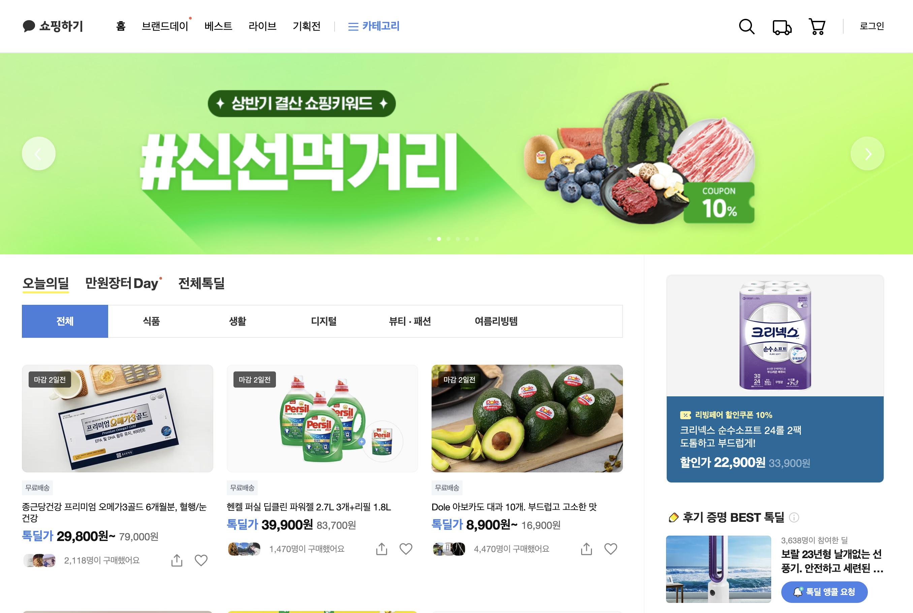
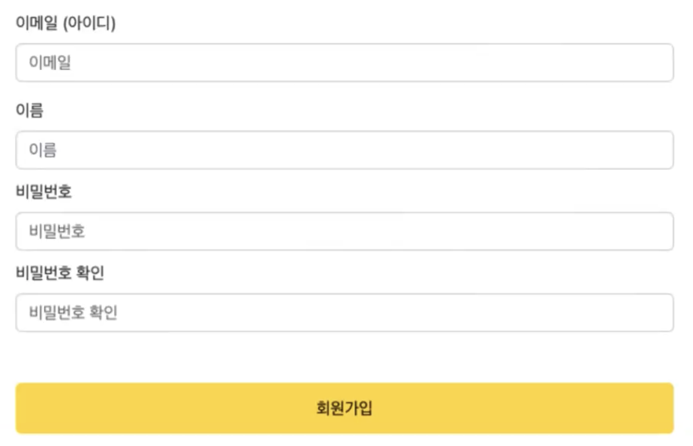
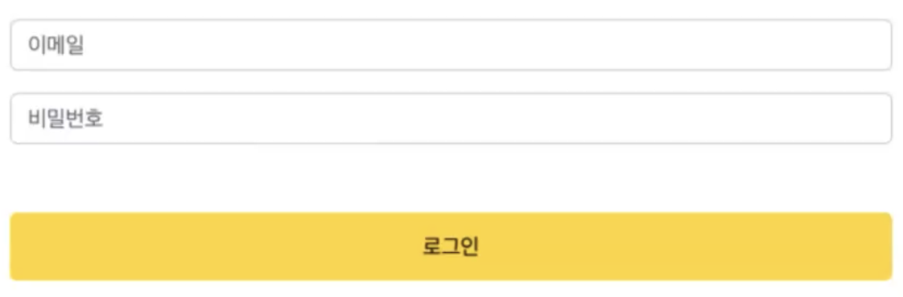
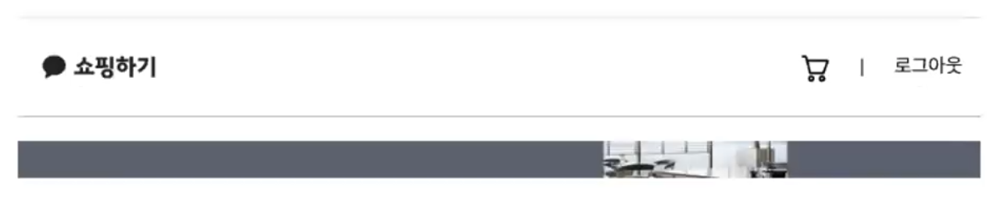
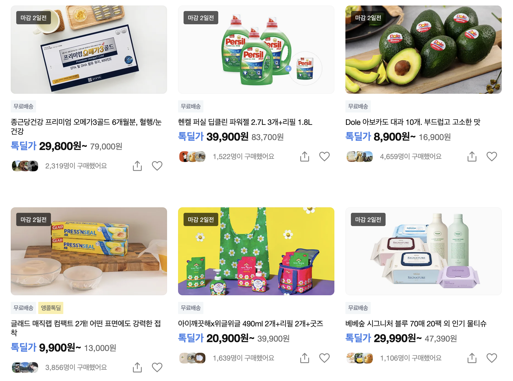
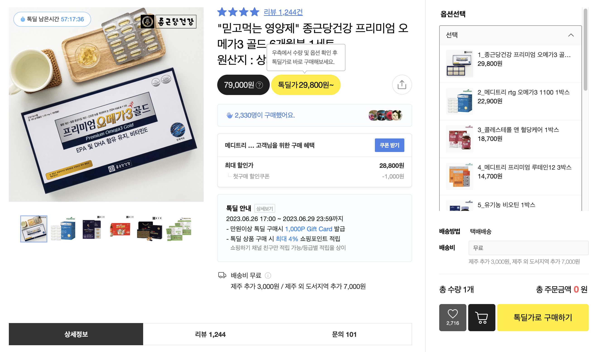

# Step-2.-Week-1

카카오 테크 캠퍼스 2단계 - FE - 1주차 클론 과제
</br>
</br>

## **과제명**

```
1. 쇼핑몰 웹사이트 탐색을 통한 페이지 구성
2. UI 컴포넌트의 명칭과 사용법 익히기
```

</br>

## **과제 설명**

```
✅ **과제 1.**

쇼핑몰 웹사이트를 탐색해 어떠한 페이지 구성을 가지고 있는지 체크합니다.
대부분의 쇼핑몰은 다음의 페이지 구성을 가지고 있습니다.

- 메인 페이지
- 상품 검색 결과 페이지
- 개별 상품 상세 페이지
- 주문 목록 페이지
- 결제 페이지
- 결제 완료 페이지
- 장바구니 페이지
- ...

이와 같이 위의 서비스가 동작하는데 필수적인 페이지가 무엇이 있고, 해당 페이지에서 어떠한 기능이 구현되어야 하는지 작성하세요.
그리고 어떠한 디렉터리 구조로 프로젝트를 진행할지 작성해주세요. (README.md 파일에 작성)
```

#페이지별 구성

<table>
  <tr>
    <th>페이지</th>
    <th>핵심 기능</th>
    <th>기능 상세 설명</th>
    <th>인터페이스</th>
  </tr>
  <tr>
    <td>(기능 1)<br />메인</td>
    <td>1. GNB<br />2. Carousel<br />3. 전체 상품 목록 조회</td>
    <td>
      사이트에 접속했을 때 가장 먼저 보이는 화면이다. <br />1. GNB는 화면
      상단에 고정하여 위치하고 홈(전체 상품 목록 조회), 장바구니&결제,
      로그인으로 구성된다. <br />2. Carousel은 GNB의 하단에 위치하고 특가와
      같은 이벤트를 보여주기 위해 6개의 슬라이드로 구성된다. <br />3. 전체 상품
      목록 조회는 Carousel의 하단에 위치하고 상품 목록을 나열한다.
    </td>
    <td></td>
  </tr>
  <tr>
    <td>(기능 2)<br />회원 가입</td>
    <td>서비스 이용을 위한 회원 가입</td>
    <td>
      1. 가입을 위해 이메일, 이름, 비밀번호가 필요하다.<br />
      2. 이메일 유효성 검사(영문+숫자@영문+숫자.영문+숫자)<br />
      3. 비밀번호 유효성 검사(공백없이 영문, 특수문자, 숫자 포함 8~20자)
    </td>
    <td></td>
  </tr>
  <tr>
    <td>(기능 3)<br />로그인</td>
    <td>회원 서비스를 이용하기 위한 로그인</td>
    <td>
      1. 이메일/비밀번호 입력 후 로그인 버튼 클릭 시, 유효성 검사<br />
      2. 에러 발생 시 입력창 하단에 에러메시지 출력<br />
      3. 유효한 경우 로그인
    </td>
    <td></td>
  </tr>
  <tr>
    <td>(기능 4)<br />로그아웃</td>
    <td>로그아웃 및 회원 서비스 종료</td>
    <td>
      GNB의 오른쪽에 위치한 로그아웃 버튼 클릭 시, 로그아웃
    </td>
    <td></td>
  </tr>
  <tr>
    <td>(기능 5)<br />전체 상품 목록 조회</td>
    <td>전체 상품 조회 및 화면 출력</td>
    <td>
      1. 전체 상품 조회 API를 통해 상품 목록을 가져온다.<br />
      2. 상품 이미지, 상품명, 가격 정보를 화면에 출력한다.
    </td>
    <td></td>
  </tr>
  <tr>
    <td>(기능 6)<br />개별 상품 상세 조회</td>
    <td>상품 선택 시, 해당 상품에 대한 정보 출력</td>
    <td>
      전체 상품 목록에서 특정 상품 카드를 클릭하면 상세 상품 조회와 옵션 조회 API를 통해 해당 상품에 대한 상세 정보와 옵션을 가져와 화면에 출력한다.
    </td>
    <td></td>
  </tr>
</table>

#디렉터리 구조

- public
- src
- components
- hooks
- routes
- styles
- dto
- ...

</br>

<!-- ✅**과제 2.**

```
프론트 개발자가 다른 프론트 개발자와 소통 및 UI 디자이너와 소통하는데 필수적인 UI 컴포넌트의 명칭과 사용법을 익힙니다.
수업시간에 배운 컴포넌트의 명칭과 사용법 이외에 대표적인 UI 라이브러리 홈페이지를 조사해보면 수많은 컴포넌트가 어떤식으로 동작하는지 확인할 수 있습니다.
리액트 프로젝트를 생성하고, 토스트, 브래드크럼, 캐러셀, 라디오버튼, 토글버튼, 체크리스트를 UI 라이브러리가 아닌 자신만의 방식으로 스타일링하고 상태 관리를 적용해 코드를 작성하세요.
작성된 코드는 레퍼지토리에 업로드하여 멘토님에게 전달해주세요.
```

</br>

✅**과제 3.**

```
각 컴포넌트를 시현해 볼 수 있는 페이지를 만드세요.
하나의 페이지에 모든 컴포넌트를 둬도 좋고, 각 페이지별로 분리해도 괜찮습니다.
```

</br>

## **과제 상세 : 수강생들이 과제를 진행할 때, 유념해야할 것**

```
1. README.md 파일은 동료 개발자에게 프로젝트에 쉽게 랜딩하도록 돕는 중요한 소통 수단입니다.
해당 프로젝트에 대해 아무런 지식이 없는 동료들에게 설명하는 것처럼 쉽고, 간결하게 작성해주세요.

2. 좋은 개발자는 디자이너, 기획자, 마케터 등 여러 포지션에 있는 분들과 소통을 잘합니다.
UI 컴포넌트의 명칭과 이를 구현하는 능력은 필수적인 커뮤니케이션 스킬이자 필요사항이니 어떤 상황에서 해당 컴포넌트를 사용하면 좋을지 고민하며 코드를 작성해보세요.
```

</br>

## **코드리뷰 관련: PR시, 아래 내용을 포함하여 코멘트 남겨주세요.**

**1. PR 제목과 내용을 아래와 같이 작성 해주세요.**

> - PR 제목 : 부산대FE\_라이언\_1주차 과제

</br>

**2. PR 내용 :**

> - 코드 작성하면서 어려웠던 점
> - 코드 리뷰 시, 멘토님이 중점적으로 리뷰해줬으면 하는 부분 -->
