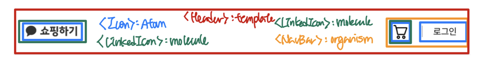
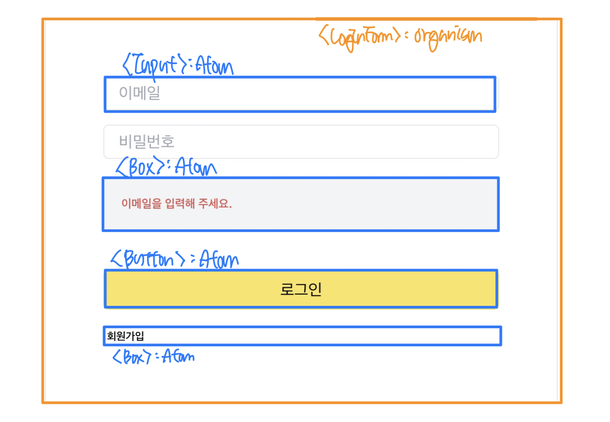

<details>
<summary>Step-2.-Week-1</summary>
<div>
  
## 카카오 테크 캠퍼스 2단계 - FE - 1주차 클론 과제

</br>

## **과제명**

```
1. 쇼핑몰 웹사이트 탐색을 통한 페이지 구성
2. UI 컴포넌트의 명칭과 사용법 익히기
```

</br>

## **과제 설명**

✅**과제 1.**

- 필수 페이지 구성
  1. 메인 페이지
  2. 로그인 페이지
  3. 회원가입 페이지
  4. 개별 상품 상세 페이지
  5. 장바구니 페이지
  6. 결제 페이지
  7. 주문 결과 확인 페이지

</br>

- 디렉터리 구조

  ```
    kakao-shopping
    ├── node_modules
    ├── public
    ├── .gitignore
    ├── package.json
    ├── README.md
    └── src
      ├─ components
      ├─ assets
      ├─ hooks
      ├─ pages
      ├─ apis
      ├─ utils
      ├─ contexts
      ├─ App.js
      └─ index.js
  ```

  디렉터리 구조는 같은 역할을 가지는 파일들끼리 묶는 형태로 만들었습니다.

  </br>

- 페이지 구성
  1. 메인 페이지
     - 핵심 기능: 상품 목록을 나열한다.
     - 기능 상세 설명
       - 상품 목록 데이터를 받아와 그리드 구조로 카테고리에 맞는 상품을 나열한다.
       - 개별 상품 상세 페이지로 이동할 수 있다.
     - 인터페이스 요구사항
       - 상품을 클릭하면 개별 상품 상세 페이지로 이동한다.
       - 상품에 마우스를 hover하면 이미지가 확대된다.

</br>

2. 로그인 페이지
   - 핵심 기능: 로그인 요청 및 사용자 로그인 정보를 저장한다.
   - 기능 상세 설명: 이메일과 비밀번호를 이용해 로그인을 진행하고, 이에 대한 상태 처리를 한다.
   - 인터페이스 요구사항
     - 이메일 또는 비밀번호에 들어온 값이 적합하지 않은 경우 적절한 알림을 보낸다.
     - 로그인 상태 유지 여부를 선택할 수 있다.

</br>

3. 회원가입 페이지
   - 핵심 기능: 사용자의 정보를 받아서 회원가입을 진행한다.
   - 기능 상세 설명
     - 이메일, 이름, 비밀번호를 입력받는다.
     - 비밀번호 확인란을 통해 비밀번호를 정확하게 입력했는지 확인한다.
   - 인터페이스 요구사항
     - 존재하는 이메일이나 이름을 입력하면 알림을 보낸다.
     - 비밀번호 입력란과 확인란의 값이 다르면 알림을 보낸다.( ex 비밀번호가 일치하지 않습니다.)

</br>

4. 개별 상품 상세 페이지
   - 핵심 기능: 상품의 상세 정보를 보여준다.
   - 기능 상세 설명
     - 옵션을 선택할 수 있다.
     - 장바구니 또는 구매하기로 넘어갈 수 있다.
   - 인터페이스 요구사항
     - 장바구니에 정상적으로 넣어지면 알림을 보낸다. 알림을 클릭하면 장바구니로 이동한다.
     - 이때 옵션을 선택하지 않고 다음 단계로 넘어가려고하면 옵션을 선택하라는 알림을 보낸다.

</br>

5. 장바구니 페이지
   - 핵심 기능: 장바구니에 들어있는 상품의 옵션과 수량을 보여준다.
   - 기능 상세 설명
     - 담긴 상품들의 수량을 조절 또는 삭제할 수 있다.
     - 주문 예상금액을 확인할 수 있다.
     - 결제 페이지로 넘어갈 수 있다.
   - 인터페이스 요구사항: 상품 수량 조절 시 주문 예상금액이 변경된다.

</br>

6. 결제 페이지
   - 핵심 기능: 주문상품 정보를 확인하고 결제를 할 수 있다.
   - 기능 상세 설명
     - 정보 제공에 대해 동의한 후 결제를 할 수 있다.
     - 결제 페이지에서는 수량 조절 및 삭제가 불가능하다.

</br>

7. 주문 결과 확인 페이지
   - 핵심 기능: 주문 상품의 정보와 결제 금액을 보여준다.
   - 기능 상세 설명: 주문 상품의 정보와 결제 금액을 보여주고, "쇼핑 계속하기" 버튼을 통해 메인 페이지로 이동이 가능하다.

</br>

✅**과제 2, 3**

- **토스트**
  

  - 토스트 컴포넌트의 보임 여부를 `state`를 사용해서 관리
  - `setTimeout` 함수를 사용해서 Toast가 열린 뒤 3초가 지나면 자동으로 닫히게 구현
  - Toast가 사라지고 나타나는 것은 `position` 속성을 `absolute`로 지정한 다음, 기본적으로는 화면에서 보이지 않게 `-right-full`로 설정하고, Toast의 `state`가 `true`가 되면 원하는 위치(`right-4`)로 변경해주어 구현

</br>

- **브래드크럼**
  

  - `useLocation` 훅을 이용해서 경로를 가져와 `state`에 리스트 형태로 경로를 나누어 구현
  - 경로를 누르면 되돌아가는 것은 `NavLink`를 사용해서 미리 입력해둔 각 주소로 이동할 수 있게 구현

</br>

- **라디오, 체크박스**
  

  - 라디오와 체크박스는 선택된 것을 `state`로 관리
  - 라디오는 하나의 값만 가질 수 있으므로 `state`를 문자열로 관리
  - 체크박스는 중복값을 가질 수 있으므로 `state`를 배열로 관리

</br>

- **토글**

  

  

  - 토글의 on, off 상태를 `state`로 관리

</br>

- **캐러셀**
  
  - 시작과 끝 슬라이드를 양 끝에 추가해주고, 만약 마지막(시작) 슬라이드에 도착하면 `translation-duration` 없이 첫 번째(마지막) 슬라이드로 이동시켜주는 방법으로 무한히 이동할 수 있게 구현
  - 현재 보여지는 슬라이드와 양 끝지점에서 `translation-duration` 조절을 `state`로 관리

</br>

</div>
</details>

---

<details>
<summary>Step-2.-Week-2</summary>
<div>

## 카카오 테크 캠퍼스 2단계 - FE - 2주차 클론 과제

</br>

## **과제명**

```
1. 아토믹 컴포넌트 디자인 패턴을 이용한 로그인, 회원가입 페이지  작성
2. 상태 관리 모듈을 사용한 사용자 정보 관리
```

</br>

## **과제 설명**

✅**과제 1. 아토믹 컴포넌트 디자인 패턴 사용**

```
- 회원가입, 로그인 페이지 개발에 필요한 컴포넌트를 아토믹 디자인 패턴을 사용해 작성하세요.
- 작성한 컴포넌트는 사용의 편의성을 위해 Props에 적절한 주석을 달아주세요.
```

아토믹 디자인 패턴은 화학적 관점에서 타나난 디자인 패턴이다. 모든 것은 atom(원자)으로 구성되어 있고 atom이 결합하여 molecule(분자)가 되고, molecule은 결합하여 더 복잡한 organism(유기체)가 되는 개념을 사용하여 `atom`, `molecule`, `organism`, `template`, `page` 5가지 레벨로 컴포넌트를 디자인하는 것을 **아토믹 디자인 패턴**이라 한다.

- **아토믹 디자인의 장점**
  작은 단위의 컴포넌트를 만들고 이들을 합쳐서 상위 레벨의 컴포넌트를 만들기 때문에 컴포넌트의 구조가 명확하다. 또한 중복되는 컴포넌트를 줄일 수 있고 컴포넌트의 재사용을 효과적으로 할 수 있다. 개인 마다 컴포넌트를 나누는 기준이 다른데, 그나마 기준을 만들 수 있다.
- **아토믹 디자인의 단점**
  비슷하게 생긴 `atom` 레벨의 컴포넌트라도 state를 가지는 것과 가지지 않는 것이 있어 어쩔 수 없이 `molecule` 레벨로 올려야하는 경우도 있고, 이벤트 핸들러를 전달해야할 때 많은 로직이 들어있는 컴포넌트라하면 부모 컴포넌트가 불필요하게 복잡해지기 때문에 컴포넌트를 분리해야하는 경우가 생길 수 있다.





하위 레벨의 컴포넌트를 포함하면 무조건 상위 레벨로 올려서 컴포넌트를 생성했다.

로그인 컴포넌트의 경우 molecule 레벨의 컴포넌트를 포함하고 있지 않지만 회원가입 컴포넌트와 레벨을 동일하게 맞추기 위해 organism 레벨에 생성했다.

</br>

✅**과제 2. 회원 가입, 로그인 페이지 개발**

```
- 백엔드 API 문서를 참고하여 회원가입, 로그인 페이지를 개발하세요.
- 각 페이지에는 적합한 값이 입력되도록 하고, 적절하지 않은 값이 들어온 경우 API 요청을 보내기 전에 프론트에서 에러 캐칭을 해주세요.
- 회원가입, 로그인 후에는 메인 페이지로 리다이렉트하세요.
- API 응답 과정에서 로그인이 실패하는 경우, 회원가입이 실패한 경우에 대해서 에러 캐칭도 적용해야 합니다.
```


로그인, 회원가입 페이지에서 입력란이 비어있거나 잘못된 입력을 작성하고 제출할 경우 API를 요청하기 전에 위 이미지와 같은 에러 메세지를 보여주고 커서를 이동시켜준다.

입력 폼의 조건이 모두 유효한 상태에서 제출을 하면 API 요청을 하게 되고 이미 존재하는 이메일로 회원가입한 경우, 등록되지 않은 이메일, 비밀번호로 로그인한 경우 등에는 에러 메세지를 보여준다.

</br>

✅**과제 3. 상태관리 모듈 적용**

```
- 로그인 후에 사용자의 정보를 상태관리 모듈을 하나 선정해 저장하고 불러올 수 있도록 코드를 작성하세요.
- 사용자가 로그인 상태일 때는 GNB 영역에 로그인 버튼이 보이면 안됩니다.
- 로그아웃시 상태를 초기화하세요.
- 새로고침 시에도 상태를 잃지 않고 유지해야 합니다.
- 일정한 시간이 지나면 로그인 유지가 끝나도록 설정하세요.(예: 1일)
```


`Redux`, `Redux-toolkit`, `Redux thunk`를 사용해서 사용자의 상태를 관리했다.

로그인을 하면 `access token`을 가져와서 쿠키에 저장하고, 쿠키에 토큰이 저장되어있는지 여부를 가지고 유저의 로그인 여부를 판단하고 관리했다. 토큰은 새로고침으로 인해 사라지지 않기 때문에 새로고침 시에도 상태는 변하지 않는다.

`localStorage`는 차제적으로 만료시간을 지정할 수 없고 만료시간을 함께 저장하여 확인해줘야하기 때문에 쿠키에 토큰을 저장했다.

</br>

</div>
</details>

---

<details>
<summary>Step-2.-Week-3</summary>
<div>

## 카카오 테크 캠퍼스 2단계 - FE - 3주차 클론 과제

</br>

## **과제명**

```
1. 비동기 통신 활용과 레이아웃
```

</br>

## **과제 설명**

✅**과제 1. 상품 목록 페이지 개발**

```
- 백엔드 API 문서를 참고하여 상품 목록 페이지를 개발하세요.
- 페이지네이션을 이용해 페이지 값을 증가시켜가며 조회될 수 있도록 코드를 작성해주세요.
- 데이터 로딩 과정에 로더를 구현하세요.
- 데이터 불러오기를 할 때 react-query를 사용해보세요.
```


상품 목록 데이터를 불러올때 `react-query`를 사용했다. `redux`와 `redux-thunk`를 사용해서 상품 데이터를 관리할 수도 있지만 굳이 상품 목록을 전역 데이터로 관리할 필요가 없다고 생각했고, 데이터를 fetch하는데 캐시, refetch 등의 더 좋은 기능을 제공하는 `react-query`를 사용하기로 결정했다.

`react-query`는 `useInfiniteQuery`라는 무한 스크롤을 구현할 수 있게 도와주는 훅이 있다. 그래서 `useInfiniteQuery`와 `IntersectionObserver`를 사용해서 무한 스크롤을 구현할 수 있었다.

로더는 `react-loader-spinner` 라이브러리를 사용해서 만들었고, `useInfiniteQuery` 훅에서 반환받은 `isFetchingNextPage`과 `hasNextPage` 값을 이용해서 데이터를 가져오는 중일때 보이도록 해줬다.

</br>

✅**과제 2. 스켈레톤과 로더**

```
- 컴포넌트에 props를 전달해 데이터 로딩 중 스켈레톤 또는 로더가 적용될 수 있도록 코드를 작성해보세요.
- 상품 목록 카드에 스켈레톤을 적용하세요.
- 페이지 전체에 대한 로딩이 진행될 때는 글로벌 로더를 적용해보세요.(적절한 모듈을 찾아 적용해도 좋습니다.)
```


웹페이지에서 시간이 어느정도 소요되는 데이터를 가져올 때 아무것도 보여주지 않고 흰 화면만 사용자에게 보여주면 사용자 경험 측면에서 굉장히 나쁘다. 이럴때 사용할 수 있는 것이 로더나 스켈레톤이다. 로더는 흔히 알고있는 로딩화면이고, 스켈레톤은 비슷한 로딩화면이지만 콘텐츠가 화면에 어떻게 나타날지 미리 알려주는 역할도 한다.

스켈레톤은 `react-loading-skeleton` 라이브러리를 사용해서 상품 하나씩의 스켈레톤 컴포넌트를 만들고 이것들을 원래 상품 목록과 같은 크기의 `Grid`형태로 컴포넌트를 만들어 구현했다. 이렇게 만든 스켈레톤 컴포넌트를 `Suspense`를 사용해서 데이터를 받아오는 동안 랜더링해주었다. `Suspense`를 사용하면 컴포넌트의 랜더링을 어떤 작업이 끝날 때까지 잠시 중단시키고 다른 컴포넌트를 먼저 랜더링할 수 있다.

</br>

✅**과제 3. 백엔드 상태 코드 반응**

```
- API 응답에 대해 전처리 하는 코드를 작성해보세요.
- 200, 300, 400, 500번 대의 상태 코드별 에러 캐칭이 필요한 경우라면 해당 함수에서 먼저 실행되도록 코드를 작성합니다.
- react-query에서 전처리하는 방식이 있다면 해당 방식을 적용하거나 또는 별도의 함수나 클래스를 만들어 관리를 시도해보면 됩니다.
```

현재 프로젝트에서 구현한 기능은 로그인, 회원가입 그리고 상품 목록을 보여주는 것이다. API 명세서에 나와있는 로그인, 회원가입, 상품 목록 기능에서의 에러는 유효성 검사와 `try...catch`문을 사용해서 처리를 했다고 생각한다.

여기서 추가로 생각해본 것은 사용자가 잘못된 URL로 접근할 경우 발생하는 404에러와 500번대 서버 에러가 있다.


404에러는 `react-router-dom`의 `errorElement`를 설정해주어 처리했다.

500번대 에러는 어떤 API 요청에서 발생할지 몰라서 전역에서 처리해주고 싶어서 `ErrorBoundary`를 사용해서 처리하는 방법을 찾았다. `ErrorBoundary`로 감싸고 있는 하위 컴포넌트 어디서든 에러가 나타나면 `fallback UI`를 대신 보여주고, 거기서 해당 에러의 종류에 맞게 처리를 해줄 수 있다. 하지만 이 기능은 아직 구현하지 못했다.

</div>
</details>

---

<details>
<summary>Step-2.-Week-4</summary>
<div>
  
## 카카오 테크 캠퍼스 2단계 - FE - 4주차 클론 과제
</br>

## **과제명**

```
상세 페이지 개발과 라이브러리
```

</br>

## **과제 설명**

✅**과제 1. 상품 상세 페이지 개발**

```
- 백엔드 API 문서를 참고하여 상품 상세 페이지를 개발하세요.
- 한 개의 UI 라이브러리를 선정해 사용해보세요.
- 적절하지 않은 상품 ID 값이 들어오거나 찾을 수 없는 상품일 때 404 페이지 또는 "상품을 찾을 수 없습니다."라는 메시지가 있는 페이지로 이동될 수 있도록 코드를 작성하세요.
- 데이터 로딩이 완료될 때까지 로더를 적용하세요.
- '장바구니 담기' 버튼과 '구매' 버튼을 나누어 배치하세요.
```


상품 상세 페이지의 핵심 기능은 상품의 상세 정보를 보여주고, 옵션을 선택한 후 장바구니 또는 구매를 할 수 있어야 한다. 옵션의 선택 상태는 전역에서 저장할 필요가 없고, 새로고침 시에도 다시 고르는게 맞다고 생각해서 `useState`를 사용해서 배열형태로 관리했다. `map`과 `filter`를 사용해서 수량 조절과 옵션 삭제를 구현했으며 로직이 길어져서 `useReducer`를 사용해서 분리해줬다.

장바구니 버튼을 클릭하면 `react-query`의 `useMutation`을 사용해서 상품을 장바구니에 추가하고 상품이 장바구니에 추가되었다는 `Toast`를 보여준다. 구매하기 버튼을 누르면 선택한 옵션들을 장바구니에 담고 결제 페이지로 이동한다.

</br>

✅**과제 2. 장바구니 페이지 개발**

```
- 백엔드 API 문서를 참고하여 장바구니 페이지를 개발하세요.
- 담아둔 상품에 대해 조회, 수량 변경, 항목 삭제가 구현되어야 합니다.
- '결제하기' 버튼을 만들고, 클릭시 결제 페이지로 이동될 수 있도록 개발하세요.
- 다른 모든 페이지와 마찬가지로 비동기 데이터 요청이 발생하니 로더 또는 스켈레톤을 통해 장바구니 목록을 불러올 때 로딩 상태를 표시하세요.
```


장바구니 페이지에서는 장바구니에 담긴 상품별 선택된 옵션을 보여주고, 각 상품별 개수와 가격을 보여준다. 상품 상세 페이지에서는 수량을 `state`로 관리하고 장바구니 담기 버튼을 누를 때 개수를 업데이트했다면, 장바구니 페이지는 상품의 개수를 실시간으로 업데이트해줘야 한다. 그래서 `useMutation`에 옵션으로 `onSuccess`에 `invalidateQueries`를 사용해서 장바구니 데이터를 다시 받아오게 만들어 새로고침하지 않아도 데이터가 업데이트되게 만들었다. `isLoading`이라는 상태를 만들어서 상품 수량을 조절하면 `mutate`를 시작할때 로더를 보여주고, `mutate`가 종료(`onSettled`)되면 로더가 사라지게 구현했다.

상품 삭제기능은 API가 구현되어있지 않아서 장바구니 상품을 받아올때 개수가 0개인 옵션은 `filter`로 삭제하고 보여주어 상품이 삭제된 것 처럼 보이게 만들었다.

추가적으로 장바구니 아이콘 옆에 장바구니에 몇개의 상품이 들어있는지를 나타내주었다. 장바구니에 상품이 없을땐 사라졌다가 상품이 들어가면 나타난다.

</div>
</details>

---

<details>
<summary>Step-2.-Week-5</summary>
<div>

## 카카오 테크 캠퍼스 2단계 - FE - 5주차 클론 과제

</br>

## **과제명**

```
주문 결제 개발
```

</br>

## **과제 설명**

✅**과제 1. 주문 결제 페이지 개발**

```
- 백엔드 API 문서를 참고하여 주문 결제 페이지를 개발하세요.
- 결제 페이지에서는 결제 전 결제 상세 정보에 대한 데이터를 조회하고, 결제를 확정하는 기능 2가지에 중점을 둡니다.
```


배송지 정보는 `react-daum-postcode` 라이브러리를 사용해서 입력받았다. "주소찾기"버튼은 검색 중에는 취소버튼으로, 주소가 설정된 상태에서는 수정버튼으로 변경된다. 배송 요청사항은 html의 `select`태그를 사용해서 구현했다.

주문상품 정보는 장바구니 데이터를 요청해서 각 상품마다 묶어서 옵션을 나열하는 방식으로 구현했고, 결제 정보도 마찬가지로 장바구니 데이터에서 가격을 더한 값으로 나타냈다.

동의 버튼은 `state`를 배열 형태로 관리했다. 체크된 체크박스만 리스트에 넣어서 관리하고, 모든 체크박스의 개수(2개)와 체크된 체크박스의 개수가 동일할때 "전체 동의하기" 체크박스가 체크되게 구현했다.

</br>

✅**과제 2. 테스트 결제**

```
- 한 개의 PG 서비스 또는 PG 서비스를 돕는 서드파티 앱을 사용해 개발합니다.
- 테스트 환경에서 결제를 성공해야 합니다.
- 결제가 실패하는 경우(잔고 부족, 결제 정보 불일치 등)에 대해 에러 캐칭을 적용하세요.
- 다양한 에러 상황에 대해 주석으로 에러 상황과 대응 방식을 설명해주세요.
```

결제는 `카카오페이`에서 제공하는 PG 서비스를 사용해서 구현했다. 카카오페이의 결제 서비스는 "요청"과 "승인" 두 단계로 이루어지는데, 요청은 문제가 없었는데 승인단계의 api 요청이 두번되어서 첫 번째 요청은 정상적으로 처리되고 결제가 완료된 화면으로 넘어가는데 콘솔창을 보면 에러가 떠 있는 상황이 발생했다. 이것은 `react`의 `strict mode`를 주석처리하고 실행하면 해결되었다.

결제가 완료되면 응답을 가지고 주문결과 확인 페이지로 이동한다.

</div>
</details>

---

<details>
<summary>Step-2.-Week-6</summary>
<div>

## 카카오 테크 캠퍼스 2단계 - FE - 6주차 클론 과제

</br>

## **과제명**

```
프로젝트 마무리
```

</br>

## **과제 설명**

✅**과제 1. 배포**

```
- Netlify를 통해 배포를 진행합니다.
- 계정을 생성하고 자신의 레포지토리를 연결해 배포합니다.
- 배포 레벨에서 사용될 환경 변수는 인스턴스에 적용되도록 직접 설정해줍니다.
- 배포에 사용될 브랜치는 개발 브랜치와 꼭 분리합니다.
```

</br>

✅**과제 2. 프로젝트 마무리**

```
- 모든 핵심 기능이 정상 작동되도록 숨은 버그와 기능을 점검합니다.
- 특정한 파일이 너무 크다면, 코드 내의 함수를 다른 파일로 옮겨 import / export 하는 등 코드 리펙터링을 진행합니다.
- 개발 환경과 배포 환경 모두 버그가 없는지 체크합니다.
```

</br>

✅**과제 3. README.md 정리**

```
- 배포한 환경에 대해 구체적인 설명을 남겨주세요.
- 포함될 내용은 배포 순서, 배포에 영향 받는 브랜치, 배포시 주의 사항, 배포 환경 등 다른 개발자가 해당 프로젝트를 인수인계 받았을 때 문제가 없도록 꼼꼼히 작성합니다.
```

</br>

## **과제 상세 : 수강생들이 과제를 진행할 때, 유념해야할 것**

```
1. 많은 서비스가 개발 레벨에서는 잘 작동하다가도 배포 단계에서 에러를 만나는 경우가 많습니다. 배포 후에 기능을 하나하나 점검해보고, 여러 환경에서 시도해보세요.

2. 배포된 환경을 하나의 브라우저에서만 테스트하지 말고, 최대한 다양한 디바이스와 브라우저에서 테스트해보세요. 삼성 브라우저, 아이폰 사파리, 데스크탑이라면 크롬, 사파리, 파이어폭스 등으로 테스트해보세요.

3. 코드를 시간이 지나서 보면 어떤 목적으로, 왜 만들었는지 알아보기 힘든 경우가 많습니다. 기본적인 내용이라 생각한 부분도 주석을 달아주세요.
```

</br>

## **코드리뷰 관련: PR시, 아래 내용을 포함하여 코멘트 남겨주세요.**

**1. PR 제목과 내용을 아래와 같이 작성 해주세요.**

> - PR 제목 : 부산대FE\_라이언\_6주차 과제

</br>

**2. PR 내용 :**

> - 코드 작성하면서 어려웠던 점
> - 코드 리뷰 시, 멘토님이 중점적으로 리뷰해줬으면 하는 부분

</div>
</details>
