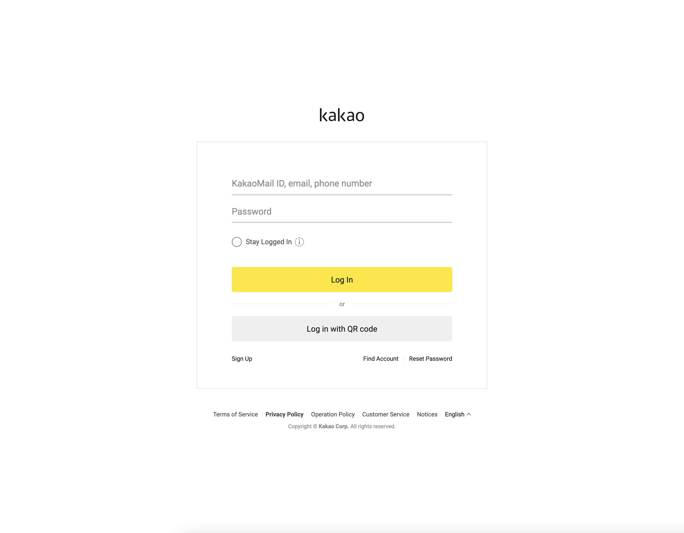
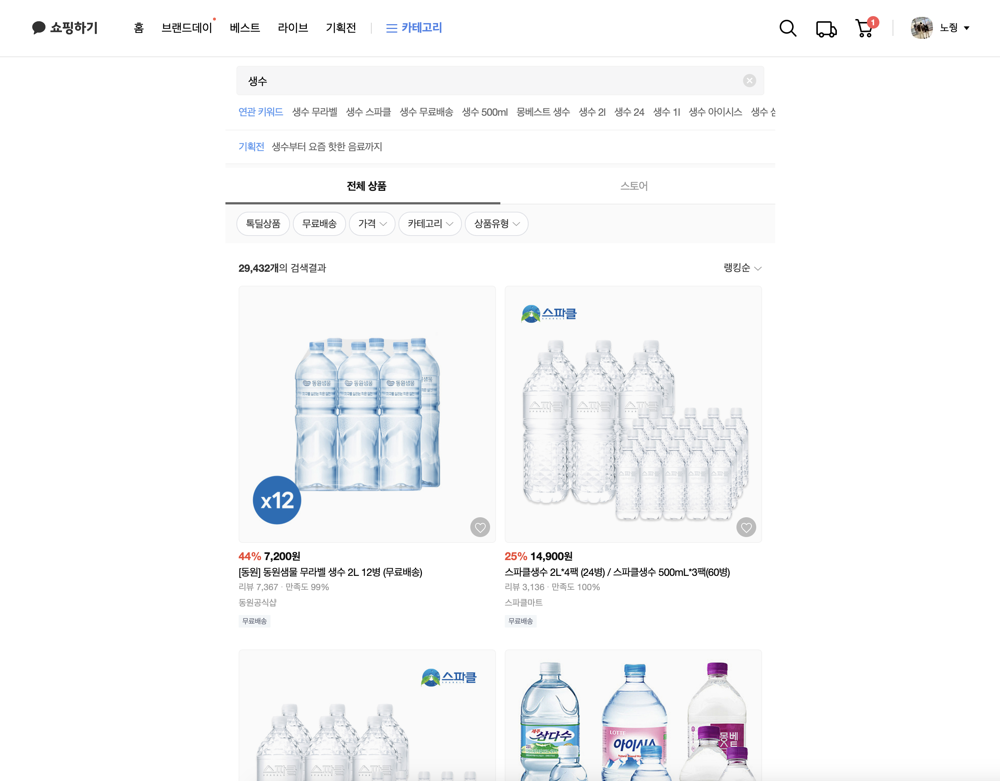
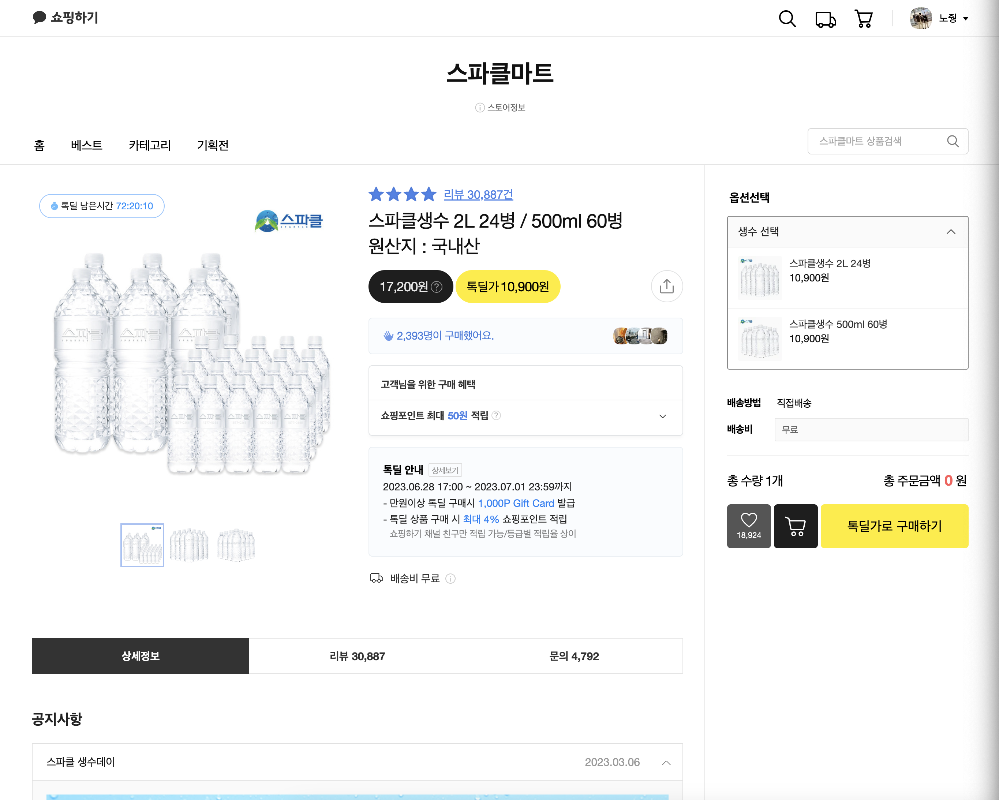
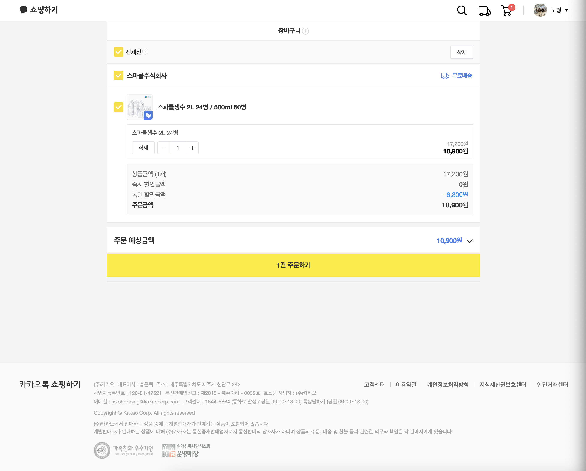
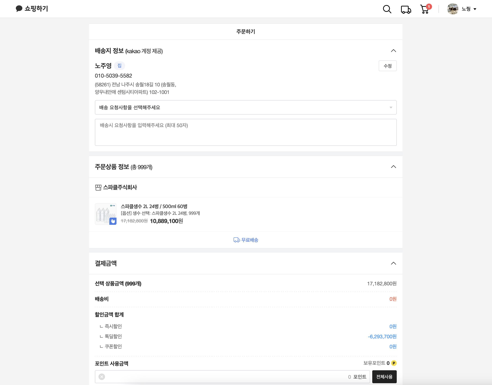

# 카카오 테크 캠퍼스 2단계 과제 <카카오톡 쇼핑하기>

## Link
https://user-app.krampoline.com/k4fd7cf548fe2a

## How to start
1. `npm install`
2. `npm start`

## 주요 기능
1. 토큰 방식 로그인-로그아웃
2. 상품 목록 Grid 형태로 표시
3. 상품 검색
4. 장바구니 담기 기능
5. 장바구니 내 상품 수량 수정
6. 장바구니 담긴 상품 구매

## 디렉터리 구성
```
public
src
ㄴcomponents - Atomic Pattern으로 구성한 컴포넌트들
ㄴhooks      - 커스텀 훅
ㄴlayouts    - 페이지 레이아웃
ㄴpages      - 각 페이지
ㄴservices   - APIs
ㄴstore      - 전역 상태
ㄴutils      - comma 함수
```


<details>
<summary>1단계 과제: 페이지 별 구성</summary>
<div>
  
### 페이지별 구성

---

1. 메인 페이지


- 핵심 기능: 사용자가 가장 먼저 마주하는 페이지로, 추천하는 상품들을 보여준다.
- 기능 상세 설명:
    - 네비게이션 바의 여러 탭을 통해 사용자의 페이지 탐색을 돕는다.
    - 주요 추천 상품이나 진행중인 이벤트들은 대형 캐러셀(Carousel)을 통해 사용자에게 눈에 띄게 보여준다.
    - 메인 탭과 서브 탭을 두어 유형별로 상품을 분류하여 보여준다.
- 인터페이스 요구사항: 사용자가 클릭하는 메뉴/상품에 따라 해당 페이지로 이동한다.

<br>

2. 로그인 페이지



- 핵심 기능: 사용자로부터 ID, 비밀번호를 입력받아 로그인할 수 있다.
- 기능 상세 설명: ID와 비밀번호를 이용해 로그인을 진행하고, 로그인 상태 처리를 한다.
- 인터페이스 요구사항
    - 정규식을 활용해 ID와 비밀번호 필드에 입력된 값이 적절한지 체크한다.
    - 사용자가 로그인 항상 유지를 원하면 해당 체크박스를 클릭하여 로그인을 유지할 수 있다.

<br>

3. 상품 검색 결과 페이지
    

    
- 핵심 기능: 검색한 키워드를 바탕으로 관련 상품 목록을 보여준다.
- 기능 상세 설명:
    - 검색한 키워드를 바탕으로 서버로부터 관련 상품들의 정보를 제공받아 상품사진, 가격, 상품명 등을 사용자 화면에 그리드 배치로 보여준다.
- 인터페이스 요구사항:
    - 각 상품을 클릭하면 해당 상품 상제 페이지로 이동한다.
    - 전체 상품/스토어 탭을 선택할 수 있다.

<br>

4. 개별 상품 상세 페이지



- 핵심 기능: 상품의 상세 정보를 보여준다.
- 기능 상세 설명:
    - 상품명, 상품 가격, 상품 상세 정보, 구매 옵션, 배송비 정보 등을 보여준다.
    - 장바구니에 담거나 구매하기 버튼을 통해 구매할 수 있다.
    - 해당 판매자의 다른 인기상품을 추천해준다.
    - 구매 혜택 사용자가 직접 클릭하여 확인할 수 있게끔 아코디언(Accordion) 형태로 보여준다.
    - 스크롤 위치에 상관없이 우측에 상품 옵션 선택과 장바구니/구매하기 버튼을 표시한다.
- 인터페이스 요구사항:
    - 구매옵션을 선택하는 메뉴를 보여주고, 현재 선택 불가능한 옵션은 보여주지 않거나 희미하게 처리하여 선택 불가능하게 한다.
    - 장바구니 버튼을 클릭하면 현재 선택한 옵션으로 장바구니에 넣어준다.
    - 구매하기 버튼을 클릭하면 현재 선택한 옵션 정보와 함께 구매 페이지로 이동한다.

<br>

5. 장바구니 페이지



- 핵심 기능: 현재 장바구니에 담긴 상품 목록을 보여주고, 주문 예상 금액과 주문하기 버튼을 보여준다.
- 기능 상세 설명:
    - 각 상품마다 체크박스가 있어 최종 주문 시 원하는 상품만 주문할 수 있도록 하고, 이에 대한 상태 관리를 한다.
    - 각 상품마다 수량을 선택할 수 있고 이에 대한 상태 관리를 한다.
    - 현재 체크된 상품과 수량에 맞게 주문 예상금액을 변경한다.
    - 주문하기 버튼을 누르면 현재 체크된 상품과 수량에 맞게 주문하기 페이지로 이동한다.
- 인터페이스 요구사항:
    - 수량을 +, - 버튼으로 클릭하여 조정하거나 직접 입력하게 하되, 범위는 1~999 내로 제한한다.
    - 상품명 좌측의 체크박스를 클릭하여 구매할 상품을 정할 수 있고, 다른 페이지로 나갔다 와도 변하지 않게 상태를 저장한다.

<br>

6. 결제 페이지
    

    
- 핵심 기능: 배송지 정보 및 결제 방식을 설정하고 PG사를 통한 결제 요청
- 기능 상세 설명:
    - 카카오 계정으로부터 제공 받은 배송지 정보와 주문할 상품 정보, 결제 금액, 포인트 사용 여부, 결제 방식등을 사용자가 지정하여 상태 관리를 한다.
    - n원 결제하기 버튼을 클릭하면 관리된 상태를 바탕으로 PG사를 통해 결제 요청을 한다.
- 인터페이스 요구사항
    - 배송지 정보/주문상품 정보/결제금액/결제방식/현금영수증/약관동의 메뉴를 아코디언(Accordion)형태로 보여준다.
    - 배송 요청사항은 드롭다운 메뉴에 저장된 프리셋을 선택할 수 있다.
    - 포인트 사용 여부는 전체사용 버튼을 누르거나 사용자가 직접 금액을 입력할 수 있다.

### 디렉터리 구조

---

```
- public
- src
|- components
|- images
|- styles
|- hooks
|- routes
|- dto
```

</div>
</details>
