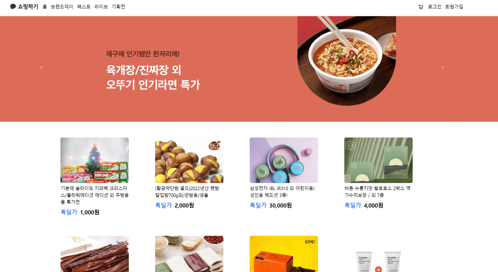

# :computer: Kakao Shop Clone Coding Project
### 프로젝트 소개
카카오 테크 캠퍼스 (카테캠) 2단계 FE 과제 수행 프로젝트 입니다.

카카오 쇼핑하기 웹사이트를 클론 코딩을 진행하였습니다.

위 프로젝트는 현업자에게 매주 코드 리뷰를 받고 코드를 리펙토링하며 진행되었습니다. 

메인화면, 상품 상세 화면, 장바구니, 결제완료 페이지가 구현되었습니다. 

### 배포주소
카카오 크램폴린 IDE를 통해 배포하였습니다. 

개발 버전 : https://user-app.krampoline.com/kd6735217eccca



## 시작 가이드
#### Requirements
- Node.js v18.16.1
- npm v9.5.1

#### Installation
```
  git clone https://github.com/mun-jihye/new-step2-FE-kakao-shop.git
  cd new-step2-FE-kakao-shop
```
```
  npm install creae-react-app
  npx create-react-app test-app
```

#### Start
```
  cd test-app
  npm start 
```

## 구현 기능

- 로그인/로그아웃/회원가입
- 전체 상품 목록 조회
- 개별 상품 별 상세 페이지/옵션 조회
- 개별 상품 옵션 선택 및 수량 설정
- 장바구니 담기
- 장바구니 목록 조회 및 수량 설정
- 상품 결제 및 주문 결과 확인 페이지

## 배운 점 & 아쉬운 점 
### 배운점
이 프로젝트는 사실상 리엑트 라이브러리를 제대로 공부하고 활용해본 첫 프로젝트 입니다.

다양한 라이브러리를 접해보고 사용해보면서 전체적인 리엑트의 사용법을 익혀나가는 것을 목적으로 이 프로젝트를 진행하였습니다. 또한 tailwind라는 새로운 ui 라이브러리를 사용하여 전체적인 css를 구현해 보았습니다.

특히 서버와 api 통신을 하면서 데이터를 주고받으면서 화면에 띄우면서 동기/비동기에 대한 개념도 확실하게 알게 되었습니다.

### 아쉬운 점
1. 현재 폴더 구조는 atomic 패턴으로 구성되어 있는데 개발 크기가 커질 수록 파일 이름도 길어지고, 뎁스가 깊져 불편함을 느꼈습니다. 추후 다른 파일 구조 패턴으로도 적용해 볼 생각입니다.

2. 현재 코드는 구현에 완전히 초점이 맞춰져 있어서 재사용성을 거의 고려하지 못했는데 코드 리펙토링을 겨쳐 재사용성이나 효율성을 고려할 수 있도록 해 볼 생각입니다. 

## 기술 스텍
### Enviroment


### Config


### Development


### CSS


### Communication


