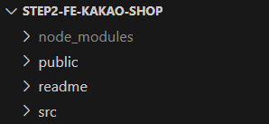

# 페이지 구성

### 회원 가입

- **핵심기능**
  - 서비스 가입을 위한 회원 가입
- **기능상세설명**
  - 이메일/이름/비밀번호/비밀번호(확인) 입력
  - 각 입력에 대한 유효성 검사 진행
    - 이메일 : 영문+숫자@영문+숫자.영문+숫자, 중복불가
    - 비밀번호 : 영문+숫자+특수문자, 공백 없음, 8~20자
    - 비밀번호(확인) : 비밀번호 동일
  - 부적합 데이터 입력 시 대응 알림 표시
  - 버튼 클릭 시 BE 서버에게 데이터 전송
- **인터페이스 요구사항**
  - 입력 : 이메일, 이름, 비밀번호, 회원가입 버튼
  - 출력 : 로그인 페이지

### 로그인

- **핵심기능**
  - 서비스 사용을 위한 로그인
  - 회원가입 페이지 이동
- **기능상세설명**
  - 이메일/비밀번호 입력
  - 각 입력에 대한 유효성 검사 진행
  - 부적합 데이터 입력 시 대응 알림 표시
  - 버튼 클릭 시 BE 서버에게 데이터 전송
  - 가입되지 않은 데이터일 경우 알림 표시
  - 가입된 데이터일 경우 로그인 수행(로그인 상태 적용)
  - 회원가입 버튼 클릭 시 회원가입 페이지 이동
- **인터페이스 요구사항**
  - 입력 : 이메일, 비밀번호, 로그인/회원가입 버튼
  - 출력 : 메인/회원가입 페이지

### 로그아웃
- **핵심기능**
  - 서비스 사용 종료를 위한 로그아웃
- **기능상세설명**
  - 버튼 클릭 시 로그아웃 수행(로그인 상태 제거)
- **인터페이스 요구사항**
  - 입력 : 로그아웃 버튼
  - 출력 : 메인 페이지

### GNB
 

- **핵심기능**
  - 주요 페이지 이동
  - 로그인/로그아웃 수행
- **기능상세설명**
  - 버튼 클릭 시 메인 페이지/장바구니 페이지 이동
  - 현재 로그인 상태에 따라 로그인/사용자(로그아웃) 표시
- **인터페이스 요구사항**
  - 입력 : 메인/장바구니/로그인/로그아웃 버튼
  - 출력 : 메인/장바구니/로그인 페이지

### 전체 상품(메인)

- **핵심기능**
  - 전체 상품 표시
  - 개별 상품 페이지 이동
- **기능상세설명**
  - BE 서버에게 전체 상품 정보 요청
  - 캐러셀 방식으로 주요 상품 정보 표시
  - 캐러셀 하단에 전체 상품 정보 표시 
  - 상품 클릭 시 대응 개별 상품 페이지 이동
- **인터페이스 요구사항**
  - 입력 : 캐러셀/전체 개별 상품 선택
  - 출력 : 전체 상품, 개별 상품 페이지

### 개별 상품

#### 1. 개별 상품
- **핵심기능**
  - 개별 상품 정보 표시
- **기능상세설명**
  - BE 서버에게 개별 상품 정보 요청 및 
  - 개별 상품 정보 표시
- **인터페이스 요구사항**
  - 출력 : 개별 상품 정보

#### 2. 옵션 선택
- **핵심기능**
  - 옵션 선택
- **기능상세설명**
  - 옵션 선택
  - 중복 옵션 시 선택 취소
  - 미중복 옵션 시 옵션 추가
- **인터페이스 요구사항**
  - 입력 : 옵션 선택
  - 출력 : 옵션 추가

#### 3. 옵션 확인 & 수량 결정
- **핵심기능**
  - 선택된 옵션 재확인
  - 옵션 수량 결정
  - 합계 가격 표시
- **기능상세설명**
  - 선택된 옵션 표시
  - 선택된 옵션 수량 선택
  - 선택된 옵션의 합계 가격 표시
- **인터페이스 요구사항**
  - 입력 : 선택된 옵션 수량 선택(+/-)
  - 출력 : 변경된 옵션, 합계 가격

#### 4. 장바구니 담기
- **핵심기능**
  - 선택된 옵션을 장바구니에 담기
- **기능상세설명**
  -  BE 서버에게 선택된 옵션 전송
  -  알림 표시
- **인터페이스 요구사항**
  - 입력 : 장바구니 버튼
  - 출력 : 알림

### 장바구니

- **핵심기능**
  - 장바구니 조회 및 수정
  - 주문하기 페이지 이동
- **기능상세설명**
  - BE 서버에게 장바구니 정보 요청
  - 장바구니 정보 표시
  - 소계/합계 가격 표시
  - 장바구니 정보 변경
  - 변경 시 BE 서버에게 변경된 장바구니 정보 전송 후 재표시
- **인터페이스 요구사항**
  - 입력 : 장바구니 정보 변경(+/-), 주문하기 버튼
  - 출력 : 변경된 장바구니 정보, 소계/합계 가격, 주문하기 페이지

### 주문하기

- **핵심기능**
  - 주문상품 정보 표시
  - 장바구니 결제 진행
- **기능상세설명**
  - BE 서버에게 장바구니 정보 요청
  - 주문 상품 정보 표시
  - 합계 가격 표시
  - 권한 동의 입력
  - 결제하기 클릭 시 결제 진행 후 주문결과 확인 페이지로 이동
  - (실제 결제 절차는 생략하고 BE 서버에게 결제 정보 전송)
- **인터페이스 요구사항**
  - 입력 : 권한 동의(체크 박스), 결제하기 버튼
  - 출력 : 주문결과 확인 페이지

### 주문 결과

- **핵심기능**
  - 주문 결과 확인
- **기능상세설명**
  - BE 서버에게 주문 결과 확인 요청
  - 주문 결과(주문 정보, 결제 금액) 표시
- **인터페이스 요구사항**
  - 입력 : 계속하기 버튼
  - 출력 : 주문 결과, 메인 페이지

 

  # 디렉터리 구조

디렉터리|역할
-|-
node_modules|npm 패키지
public|non-compile 대상
readme|README.md
src|compile 대상

디렉터리|역할
-|-
apis|API
assets|미디어
components|컴포넌트
hooks|커스텀 훅
pages|라우팅 페이지
styles|CSS
utils|유틸리티(상수, 함수 등)