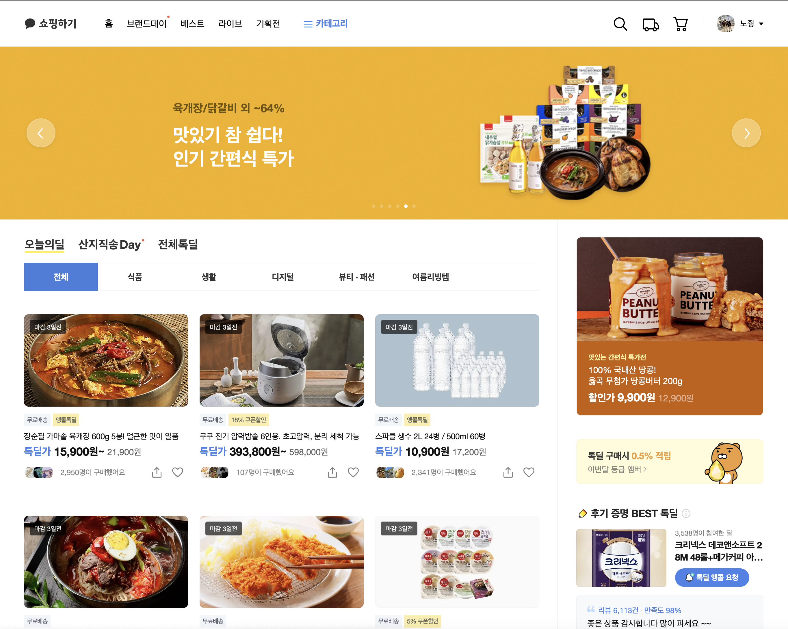

<details>
<summary>Step-2.-Week-1</summary>
<div>
  
### 페이지별 구성

---

1. 메인 페이지



- 핵심 기능: 사용자가 가장 먼저 마주하는 페이지로, 추천하는 상품들을 보여준다.
- 기능 상세 설명:
    - 네비게이션 바의 여러 탭을 통해 사용자의 페이지 탐색을 돕는다.
    - 주요 추천 상품이나 진행중인 이벤트들은 대형 캐러셀(Carousel)을 통해 사용자에게 눈에 띄게 보여준다.
    - 메인 탭과 서브 탭을 두어 유형별로 상품을 분류하여 보여준다.
- 인터페이스 요구사항: 사용자가 클릭하는 메뉴/상품에 따라 해당 페이지로 이동한다.

<br>

2. 로그인 페이지


- 핵심 기능: 사용자로부터 ID, 비밀번호를 입력받아 로그인할 수 있다.
- 기능 상세 설명: ID와 비밀번호를 이용해 로그인을 진행하고, 로그인 상태 처리를 한다.
- 인터페이스 요구사항
    - 정규식을 활용해 ID와 비밀번호 필드에 입력된 값이 적절한지 체크한다.
    - 사용자가 로그인 항상 유지를 원하면 해당 체크박스를 클릭하여 로그인을 유지할 수 있다.

<br>

3. 상품 검색 결과 페이지
    

    
- 핵심 기능: 검색한 키워드를 바탕으로 관련 상품 목록을 보여준다.
- 기능 상세 설명:
    - 검색한 키워드를 바탕으로 서버로부터 관련 상품들의 정보를 제공받아 상품사진, 가격, 상품명 등을 사용자 화면에 그리드 배치로 보여준다.
- 인터페이스 요구사항:
    - 각 상품을 클릭하면 해당 상품 상제 페이지로 이동한다.
    - 전체 상품/스토어 탭을 선택할 수 있다.

<br>

4. 개별 상품 상세 페이지


- 핵심 기능: 상품의 상세 정보를 보여준다.
- 기능 상세 설명:
    - 상품명, 상품 가격, 상품 상세 정보, 구매 옵션, 배송비 정보 등을 보여준다.
    - 장바구니에 담거나 구매하기 버튼을 통해 구매할 수 있다.
    - 해당 판매자의 다른 인기상품을 추천해준다.
    - 구매 혜택 사용자가 직접 클릭하여 확인할 수 있게끔 아코디언(Accordion) 형태로 보여준다.
    - 스크롤 위치에 상관없이 우측에 상품 옵션 선택과 장바구니/구매하기 버튼을 표시한다.
- 인터페이스 요구사항:
    - 구매옵션을 선택하는 메뉴를 보여주고, 현재 선택 불가능한 옵션은 보여주지 않거나 희미하게 처리하여 선택 불가능하게 한다.
    - 장바구니 버튼을 클릭하면 현재 선택한 옵션으로 장바구니에 넣어준다.
    - 구매하기 버튼을 클릭하면 현재 선택한 옵션 정보와 함께 구매 페이지로 이동한다.

<br>

5. 장바구니 페이지


- 핵심 기능: 현재 장바구니에 담긴 상품 목록을 보여주고, 주문 예상 금액과 주문하기 버튼을 보여준다.
- 기능 상세 설명:
    - 각 상품마다 체크박스가 있어 최종 주문 시 원하는 상품만 주문할 수 있도록 하고, 이에 대한 상태 관리를 한다.
    - 각 상품마다 수량을 선택할 수 있고 이에 대한 상태 관리를 한다.
    - 현재 체크된 상품과 수량에 맞게 주문 예상금액을 변경한다.
    - 주문하기 버튼을 누르면 현재 체크된 상품과 수량에 맞게 주문하기 페이지로 이동한다.
- 인터페이스 요구사항:
    - 수량을 +, - 버튼으로 클릭하여 조정하거나 직접 입력하게 하되, 범위는 1~999 내로 제한한다.
    - 상품명 좌측의 체크박스를 클릭하여 구매할 상품을 정할 수 있고, 다른 페이지로 나갔다 와도 변하지 않게 상태를 저장한다.

<br>

6. 결제 페이지
    

    
- 핵심 기능: 배송지 정보 및 결제 방식을 설정하고 PG사를 통한 결제 요청
- 기능 상세 설명:
    - 카카오 계정으로부터 제공 받은 배송지 정보와 주문할 상품 정보, 결제 금액, 포인트 사용 여부, 결제 방식등을 사용자가 지정하여 상태 관리를 한다.
    - n원 결제하기 버튼을 클릭하면 관리된 상태를 바탕으로 PG사를 통해 결제 요청을 한다.
- 인터페이스 요구사항
    - 배송지 정보/주문상품 정보/결제금액/결제방식/현금영수증/약관동의 메뉴를 아코디언(Accordion)형태로 보여준다.
    - 배송 요청사항은 드롭다운 메뉴에 저장된 프리셋을 선택할 수 있다.
    - 포인트 사용 여부는 전체사용 버튼을 누르거나 사용자가 직접 금액을 입력할 수 있다.

### 디렉터리 구조

---

```
- public
- src
|- components
|- images
|- styles
|- hooks
|- routes
|- dto
```

</div>
</details>

---

<details>
<summary>Step-2.-Week-2</summary>
<div>

```
이해가 힘든 부분이 많아 일단 의도한대로 돌아가게끔 하는 것을 목표로 삼고 과제를 수행했습니다. 제 머리로 생각하고 구현한 것 보다 다른 사람의 포스팅을 참고한 부분이 더 많아서 기술 부채를 많이 진 느낌입니다. 이자가 생기기 전에 빨리 갚아 나가야겠습니다.
```

---

## ✅ 과제 1: 회원가입 폼 구현
### [1-1] 회원가입 폼 구현

Atomic pattern을 활용해 회원가입 폼을 구현했습니다. 구현하고 난 뒤 프로젝트 구조는 다음과 같습니다.
</br>

```
src
├── components
│   ├── atoms
│   │   ├── Box.jsx
│   │   ├── Button.jsx
│   │   ├── Container.jsx
│   │   ├── Input.jsx
│   │   ├── Label.jsx
│   │   └── Title.jsx
│   ├── molecules
│   │   ├── InputGroup.jsx
│   │   ├── NavBar.jsx
│   │   └── Timer.jsx
│   └── organisms
│       ├── LoginForm.jsx
│       └── RegisterForm.jsx
└── pages
    ├── LoginPage.jsx
    └── RegisterPage.jsx
```
</br>

### [1-2] 작성한 컴포넌트 Props에 주석
각 컴포넌트에 props에 주석을 달아놓았습니다.

---

## ✅ 과제 2: 회원가입/로그인 페이지 개발
### [2-1] 입력값 검사하여 메시지 띄워주기
```<Input/>``` 컴포넌트에서 onBlur 이벤트가 발생하면 입력값에 대해 정규식 검사를 수행하는 방식으로 구현했습니다.

### [2-2] 회원가입/로그인 후 메인으로 리다이렉트
서버 응답으로 200 OK를 수신하면 ```useNavigate()```를 활용하여 메인 페이지로 리다이렉트합니다.

### [2-3] API 응답 과정에서 로그인/회원가입이 실패한 경우에 대해 에러 캐칭 적용
서버로부터 받은 응답을 AXIOS Interceptors에서 가로채서 응답 안에 있는 에러 메시지를 페이지에 출력하는 방식으로 구현했습니다.

---

## ✅ 과제 3: 상태관리 모듈 적용
### [3-1] 로그인 후 사용자 정보를 저장하고 불러올 수 있도록 코드 작성
2주차 강의에서 ```redux-thunk```, ```redux-saga``` 등을 배웠지만, 현재 지식수준에서 이해 및 구현이 어려워서 ```redux```만을 활용하여 구현하였습니다.
</br>
전역적으로 email이라는 상태를 관리합니다. email 안에 데이터가 있다면 로그인 상태, null이라면 로그아웃 상태로 구분했습니다.
</br>
프로젝트 내 어디서든 ```useSelector()```를 활용하여 전역 상태에 접근 가능합니다.

### [3-2] 로그온 상태일 땐은 GNB 영역에 로그인 버튼이 안보이게 처리
email이라는 전역 상태를 통해 로그인 상태를 구분할 수 있게 되었으니, 상황에 따라 로그인/로그아웃 버튼도 구분해서 표시해줍니다. ```<NavBar>``` 컴포넌트 안에서 분기문을 활용하여 구현하였습니다.

### [3-3] 로그아웃 시 상태 초기화
로그아웃 버튼의 onClick 이벤트가 발생하면 email 상태가 null이 되게 처리하였습니다.

### [3-4] 새로고침 시에도 상태 잃지 않고 유지
이 기능을 구현하기 위해 ```redux-persist``` 모듈을 추가로 설치하였습니다. 아직 이해가 낮은 터라 온라인 상에 나와있는 관련 포스트를 많이 참고하여 구현하였습니다. 

### [3-5] 일정한 시간이 지나면 로그인 유지가 끝나도록 설정
먼저 남은 시간을 보여주기 위해 organisms 디렉토리에 ```<Timer>``` 컴포넌트를 새로 작성하였습니다. 로그인이 될 때 ```<Timer>``` props에 현재 시간을 저장하고, 로그인 유지 시간을 ms 단위로 입력해주면 해당 시간 이후 자동으로 email이 null이 되게 해주는 기능을 만들어...보려고 했습니다. 하지만 어떤 이유에서인지, 타이머는 동작하지만 시간이 지나도 로그인이 되지 않습니다.

</div>
</details>

---

<details>
<summary>Step-2.-Week-3</summary>
<div>

---

## ✅ 과제 1: 상품 목록 페이지 개발
### [1-1] 백엔드 API 문서를 참고하여 상품 목록 페이지 개발
가장 작은 단위부터 차례로 Card, ProductCard, ProductGrid, MainProductTemplate 컴포넌트를 작성했습니다. Axios를 통해 API를 호출하여 데이터를 수신해 Redux로 상태를 관리하였습니다.

### [1-2] Pagination 이용해 페이지 값을 증가시켜가며 조회할 수 있도록 코드 작성
Intersection Observer API를 활용하여 Observer영역에 Intersect할 때마다 새로운 페이지를 로드하도록 구현하였습니다. 상세한 내용은 ```src/components/templates/MainProductTemplate.jsx```에 기술되어 있습니다. 마지막 페이지에 도달해도 Insersect를 계속 감지하는 문제가 있습니다.

### [1-3] 데이터 로딩 과정에 Loader 구현
```codepen.io```에 올라와 있는 Loader를 가져왔습니다. ```src/components/atoms/Loader.jsx```에 기술되어 있습니다. loading 상태가 true일 때 Loader가 보이게 구성했습니다. 해당 내용은 ```src/components/templates/MainProductTemplate.jsx```의 return문에서 확인하실 수 있습니다.

### [1-4] 데이터 불러오기 할 때 react-query 사용
상품의 상세 정보를 가져올 때 react-query를 사용했습니다. ```src/pages/ProductDetailPage.jsx```에 해당 내용이 기술되어 있습니다. 앞으로 상품 목록을 불러올 때도 해당 라이브러리를 적용할 예정입니다.

## ✅ 과제 2: 스켈레톤과 로더
### [2-1] 컴포넌트에 props를 전달해 데이터 로딩 중 스켈레톤 또는 로더가 적용될 수 있도록 코드 작성
상품 목록 페이지에 스켈레톤을 적용하기 위해 loading 상태를 전달하는 과정이 필요했습니다. MainProductTemplate 컴포넌트에서 loading 상태를 가져와 ProductGrid -> ProductCard까지 전달합니다. ProductCard에서 삼항 연산자를 사용해 loading 상태에 따라 스켈레톤을 보여줄지, 실제 데이터를 보여줄지를 결정합니다.

### [2-2] 상품 목록 카드에 스켈레톤 적용
실제 모양과 비슷하게 스켈레톤 컴포넌트를 작성했습니다. ```src/components/skeletons/ProductCardSkeleton.jsx```에 구현되어 있습니다.

## ✅ 과제 3: 백엔드 상태 코드 반응
### [3-1] 200, 300, 400, 500번 대의 상태 코드별 에러 캐칭이 필요한 경우라면 해당 함수에서 먼저 실행되도록 코드 작성
Axios Interceptor에 해당 내용을 구현했습니다. 사실 과제를 잘 이해하지 못해서 제대로 구현했는지 모르겠습니다. 내용은 `src/services/index.js`의 응답 인터셉터에서 확인하실 수 있습니다.

</div>
</details>

---

<details>
<summary>Step-2.-Week-4</summary>
<div>
  
## 카카오 테크 캠퍼스 2단계 - FE - 4주차 클론 과제
</br>

## **과제명**
```
상세 페이지 개발과 라이브러리
```
</br>

## **과제 설명**

✅**과제 1. 상품 상세 페이지 개발**
```
- 백엔드 API 문서를 참고하여 상품 상세 페이지를 개발하세요.
- 한 개의 UI 라이브러리를 선정해 사용해보세요. 
- 적절하지 않은 상품 ID 값이 들어오거나 찾을 수 없는 상품일 때 404 페이지 또는 "상품을 찾을 수 없습니다."라는 메시지가 있는 페이지로 이동될 수 있도록 코드를 작성하세요.
- 데이터 로딩이 완료될 때까지 로더를 적용하세요.
- '장바구니 담기' 버튼과 '구매' 버튼을 나누어 배치하세요.
```

</br>

✅**과제 2. 장바구니 페이지 개발**

```
- 백엔드 API 문서를 참고하여 장바구니 페이지를 개발하세요.
- 담아둔 상품에 대해 조회, 수량 변경, 항목 삭제가 구현되어야 합니다.
- '결제하기' 버튼을 만들고, 클릭시 결제 페이지로 이동될 수 있도록 개발하세요.
- 다른 모든 페이지와 마찬가지로 비동기 데이터 요청이 발생하니 로더 또는 스켈레톤을 통해 장바구니 목록을 불러올 때 로딩 상태를 표시하세요.
```

</br>

## **과제 상세 : 수강생들이 과제를 진행할 때, 유념해야할 것**
```
1. UI 라이브러리를 사용할 때 모든 구성요소에 UI 라이브러리의 규칙을 적용할 필요는 없습니다. UI 라이브러리의 사용법을 익히고, 하나 이상의 컴포넌트에 적용해봅니다.
```
</br>

## **코드리뷰 관련: PR시, 아래 내용을 포함하여 코멘트 남겨주세요.**
**1. PR 제목과 내용을 아래와 같이 작성 해주세요.**

>- PR 제목 : 부산대FE_라이언_4주차 과제

</br>

**2. PR 내용 :**

>- 코드 작성하면서 어려웠던 점
>- 코드 리뷰 시, 멘토님이 중점적으로 리뷰해줬으면 하는 부분


</div>
</details>

---

<details>
<summary>Step-2.-Week-5</summary>
<div>

## 카카오 테크 캠퍼스 2단계 - FE - 5주차 클론 과제
</br>

## **과제명**
```
주문 결제 개발 
```
</br>

## **과제 설명**

✅**과제 1. 주문 결제 페이지 개발**
```
- 백엔드 API 문서를 참고하여 주문 결제 페이지를 개발하세요.
- 결제 페이지에서는 결제 전 결제 상세 정보에 대한 데이터를 조회하고, 결제를 확정하는 기능 2가지에 중점을 둡니다.
```

</br>

✅**과제 2. 테스트 결제**

```
- 한 개의 PG 서비스 또는 PG 서비스를 돕는 서드파티 앱을 사용해 개발합니다.
- 테스트 환경에서 결제를 성공해야 합니다.
- 결제가 실패하는 경우(잔고 부족, 결제 정보 불일치 등)에 대해 에러 캐칭을 적용하세요.
- 다양한 에러 상황에 대해 주석으로 에러 상황과 대응 방식을 설명해주세요.
```

</br>

## **과제 상세 : 수강생들이 과제를 진행할 때, 유념해야할 것**
```
1. 결제를 구현할 때 새로운 모듈을 학습하는데 있어서 생각보다 시간 소요가 클 것입니다. 또한 몇몇의 PG사에서 제공하는 SDK의 경우 리액트와 호환성이 나쁜 경우도 있습니다. 
2. 테스트 결제시에 실제 비용이 나가는 것처럼 보이는 경우도 있습니다. PG사마다 정책이 다르지만 대부분 테스트 금액은 1일 이내로 환급받는 구조입니다.
3. 결제시에는 생각보다 많은 데이터를 하나의 페이로드에 담아 전달해야 합니다. 이 과정에서 데이터가 적절하지 않은 값이 들어갈 가능성이 높고, 코드가 복잡해질 수 있습니다. 기능 단위를 나누어 함수형 프로그래밍을 시도해보는게 도움이 될 수 있습니다.
```
</br>

## **코드리뷰 관련: PR시, 아래 내용을 포함하여 코멘트 남겨주세요.**
**1. PR 제목과 내용을 아래와 같이 작성 해주세요.**

>- PR 제목 : 부산대FE_라이언_5주차 과제

</br>

**2. PR 내용 :**

>- 코드 작성하면서 어려웠던 점
>- 코드 리뷰 시, 멘토님이 중점적으로 리뷰해줬으면 하는 부분


</div>
</details>


---


<details>
<summary>Step-2.-Week-6</summary>
<div>

## 카카오 테크 캠퍼스 2단계 - FE - 6주차 클론 과제
</br>

## **과제명**
```
프로젝트 마무리
```
</br>

## **과제 설명**

✅**과제 1. 배포**
```
- 카카오 배포환경을 통해 배포를 진행합니다.
- 계정을 생성하고 자신의 레포지토리를 연결해 배포합니다.
- 배포 레벨에서 사용될 환경 변수는 인스턴스에 적용되도록 직접 설정해줍니다.
- 배포에 사용될 브랜치는 개발 브랜치와 꼭 분리합니다.
```

</br>

✅**과제 2. 프로젝트 마무리**

```
- 모든 핵심 기능이 정상 작동되도록 숨은 버그와 기능을 점검합니다.
- 특정한 파일이 너무 크다면, 코드 내의 함수를 다른 파일로 옮겨 import / export 하는 등 코드 리펙터링을 진행합니다.
- 개발 환경과 배포 환경 모두 버그가 없는지 체크합니다.
```

</br>

✅**과제 3.  README.md 정리**

```
- 배포한 환경에 대해 구체적인 설명을 남겨주세요.
- 포함될 내용은 배포 순서, 배포에 영향 받는 브랜치, 배포시 주의 사항, 배포 환경 등 다른 개발자가 해당 프로젝트를 인수인계 받았을 때 문제가 없도록 꼼꼼히 작성합니다.
```

</br>

## **과제 상세 : 수강생들이 과제를 진행할 때, 유념해야할 것**
```
1. 많은 서비스가 개발 레벨에서는 잘 작동하다가도 배포 단계에서 에러를 만나는 경우가 많습니다. 배포 후에 기능을 하나하나 점검해보고, 여러 환경에서 시도해보세요.

2. 배포된 환경을 하나의 브라우저에서만 테스트하지 말고, 최대한 다양한 디바이스와 브라우저에서 테스트해보세요. 삼성 브라우저, 아이폰 사파리, 데스크탑이라면 크롬, 사파리, 파이어폭스 등으로 테스트해보세요.

3. 코드를 시간이 지나서 보면 어떤 목적으로, 왜 만들었는지 알아보기 힘든 경우가 많습니다. 기본적인 내용이라 생각한 부분도 주석을 달아주세요.
```
</br>

## **코드리뷰 관련: PR시, 아래 내용을 포함하여 코멘트 남겨주세요.**
**1. PR 제목과 내용을 아래와 같이 작성 해주세요.**

>- PR 제목 : 부산대FE_라이언_6주차 과제

</br>

**2. PR 내용 :**

>- 코드 작성하면서 어려웠던 점
>- 코드 리뷰 시, 멘토님이 중점적으로 리뷰해줬으면 하는 부분


</div>
</details>

