# 과제 1 수행내용

## 1. 페이지 상세

### 1. 메인 페이지

- 핵심 기능 : 상품 리스트를 보여주는 기능
- 기능 상세 설명 : 네비게이션 바와 상품 리스트를 표시함
- 인터페이스 요구사항 :

  - 상단 네비게이션 바
    - 홈 페이지로 가는 홈 버튼과 각종 이벤트 탭 버튼
    - 검색창
    - 장바구니 버튼
    - 배송조회 버튼
    - 로그인 버튼 / 로그인 되었을 경우 회원정보와 관련된 버튼
  - 캐러샐
    - 배너광고를 위한 캐러셀
    - 좌 우 버튼을 통해 조작 가능
    - 이미지 클릭할 시, 그에 알맞는 페이지로 이동
  - 상품 리스트
    - 각 상품에 대한 이미지, 상품명, 가격, 할인율, 할인가격, 종아요버튼, 공유버튼, 마감뱃지
    - 각 상품을 클릭할 시 해당 상품 페이지로 이동

  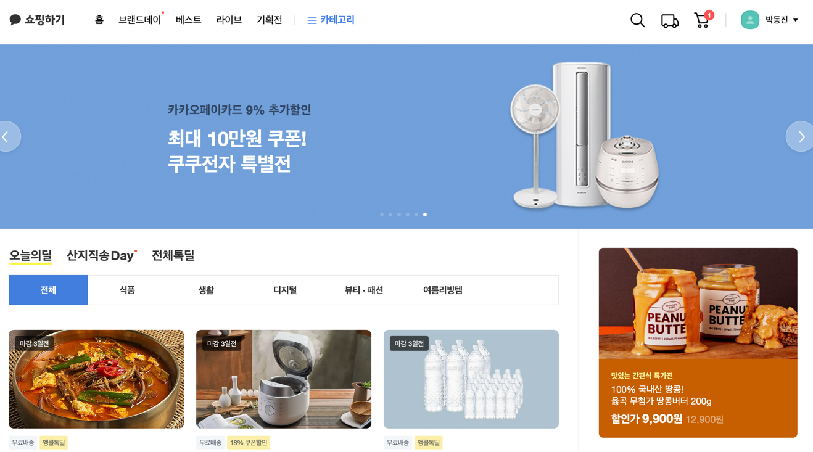
  </br>

2. 상품 검색 페이지

- 핵심 기능 : 상품의 검색을 가능하게 함
- 기능 상세 설명 : 상품을 검색했을 경우 해당 키워드는 최근 검색어에 저장되며, 검색어를 클릭할 시 해당 검색어로 검색한 결과를 보여줌
- 인터페이스 요구사항 : 검색어 입력 전에는 추천 검색어를 보여주고, 검색어 입력 시에는 예상되는 검색어를 드롭다운으로 보여줌

  - 검색창
    - 검색어 입력창
    - 검색 버튼
    - 추천 검색어 드롭다운
  - 검색추천 리스트
    - 최근 검색어, 추천 검색어, 카테고리 메뉴를 보여줌
      - 최근 검색어 : 최근 검색한 검색어를 보여줌 x표를 눌러 삭제 가능
      - 인기 검색어 : 검색어 입력 전에는 최근 인기 검색어를 보여줌

  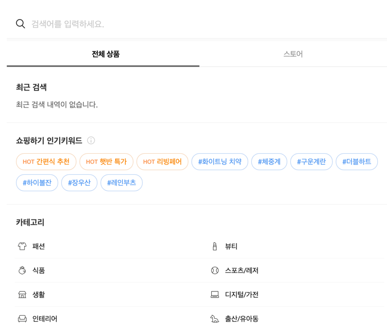

3. 상품 검색 결과 페이지

- 핵심 기능 : 검색어에 대한 상품 리스트를 보여줌
- 기능 상세 설명 : 상품 리스트를 필터링할 수 있으며, 각 상품을 클릭할 시 해당 상품 페이지로 이동. 연관 키워드를 보여주며, 키워드 클릭 시, 해당 키워드를 검색한 결과를 보여줌
- 인터페이스 요구사항 : 각종 필터를 사용 가능

  - 필터 : 각 필터를 클릭할 시, 모달창으로 필터를 설정 가능

    - 가격 필터 : 최소, 최대 가격을 설정하여 해당 가격 범위에 해당하는 상품만 보여줌

      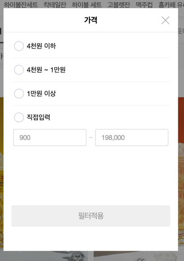

    - 카테고리 필터 : 카테고리를 선택하여 해당 카테고리에 해당하는 상품만 보여줌.
      카테고리는 트리 구조로 선택 가능. 상위 카테고리를 선택하면 드롭 다운으로 하위 카테로리를 보여주는 방식

      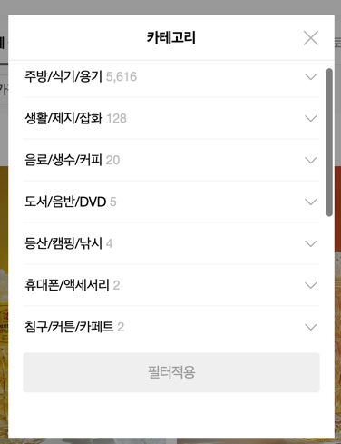

    - 상품유형 : 톡채널 친구전용 상품, 카카오파머 상품을 체크리스트로 체크 가능

      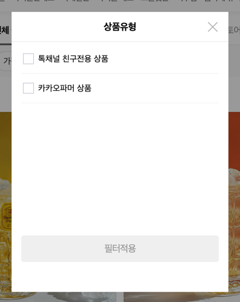

    - 상품 정렬 : 상품을 기준에 따라 정렬할 수 있음

      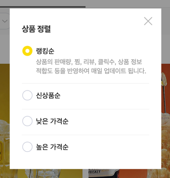

4. 개별 상품 상세 페이지

- 핵심 기능 : 상품의 상세 정보를 보여줌
- 기능 상세 설명 : 좋아요표시, 장바구니 담기, 바로구매 가능
- 인터페이스 요구사항 : 옵션을 선택하면 장바구니에 담기 혹은 바로구매를 할 수 있음.

  - 판매자정보 : 상단에는 판매자 정보 배너를 보여줌
  - 상품 사진 : 상품의 사진을 보여줌, 하단의 작은 사진을 클릭하면 상단의 사진이 변경됨
  - 옵션 선택 및 주문 : 해당 화면은 화면 우측에 고정

    - 옵션 선택 : 드롭다운 메뉴를 통해 옵션을 선택할 수 있음.
      옵션에 따라 상품의 가격과 총 수량이 변경됨

  - 연관 상품 : 해당 상품과 연관된 상품을 보여줌

    - 캐러샐 형태, 좌 우 버튼을 통해서 조작 가능
    - 상품 클릭 시 해당 상품 페이지로 이동
      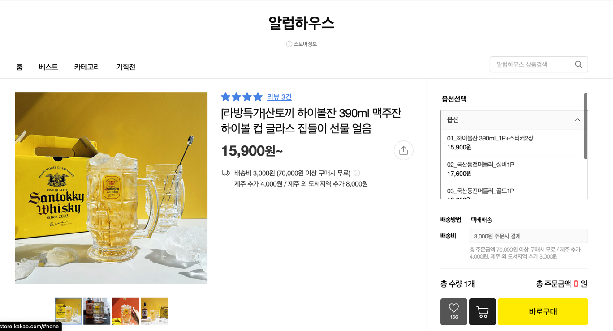

  - 하단 큰 탭
    - 상세정보 : 화면의 상세정보를 보여줌
    - 리뷰 : 상품에 대한 리뷰를 보여줌
    - 문의 : 상품에 대한 문의를 보여줌
      
  - 같은 스토어에서 판매중인 상품 :
    - 캐러샐 형태로 보여줌
    - 상품 클릭 시 해당 상품 페이지로 이동
      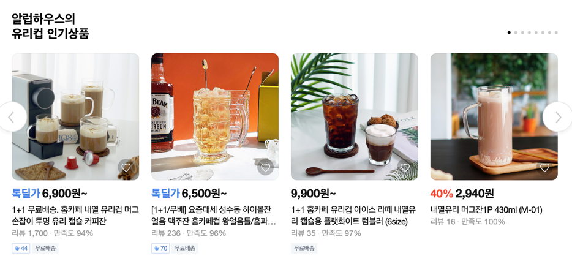

5. 장바구니 페이지

- 핵심 기능 : 장바구니에 담긴 상품을 보여줌
- 기능 상세 설명 : 상품의 수량을 변경하거나 삭제 가능
- 인터페이스 요구 사항 : 상품의 수량을 변경, 삭제할 경우 하단의 총 금액을 다시 산출. 체크박스를 통해 주문할 상품을 선택 가능, 체크박스에 따라 총 가격 재산출
  - 상품 리스트 : 상품은 마켓 별로 구분되어 보여짐
  - 상품 수량 변경 : 상품의 수량을 변경할 수 있음
  - 상품 삭제 : 상품을 삭제할 수 있음, 상품별, 스토어별로 삭제 가능
    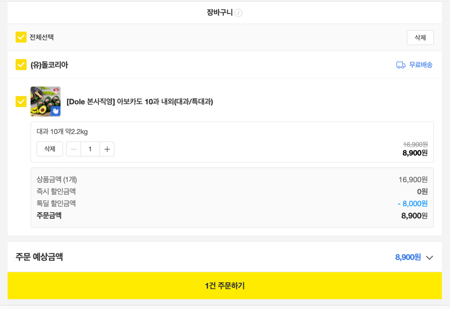

6. 주문 페이지

- 핵심 기능 : 주문서를 작성합니다.
- 기능 상세 설명 : 주문할 상품, 배송지정보, 결제 수단을 선택합니다. 부족한 정보, 정보수집 동의가 이루어지지 않으면 주문이 불가능합니다.
- 인터페이스 요구 사항 : 각 인터페이스는 아코디언 형식으로 접을 수 있음

  - 배송지 정보 : 배송지 정보는 카카오 주소 API를 사용하여 입력
  - 배송 요청사항 :
    - 드롭다운으로 배송 요청사항을 선택할 수 있음
    - 선택하지 않을 시 직접 입력 가능 (50자 이내)
    - placeholder문구는 배송시 요청사항을 입력해주세요(최대 50자)
  - 주문상품 정보 :

    - 각 스토어별로 나열
    - 상품 이름, 옵션, 가격과 학인가격을 보여줌

    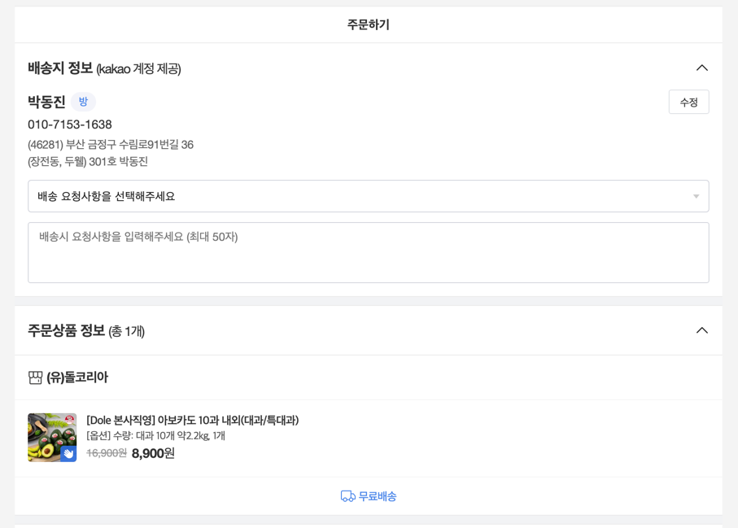

  - 결제금액 : 총 상품금액, 배송비, 총 결제금액을 보여줌
    - 포인트 사용금액 : 포인트를 사용할 수 있음
  - 결제수단 : 기본적으로 카카오페이머니, 카카오페이카드를 콤보박스로 선택 가능

    - 카카오페이머니, 카카오페이카드 : 콤보박스로 선택 가능
      - 기본 선택은 카카오페이머니

    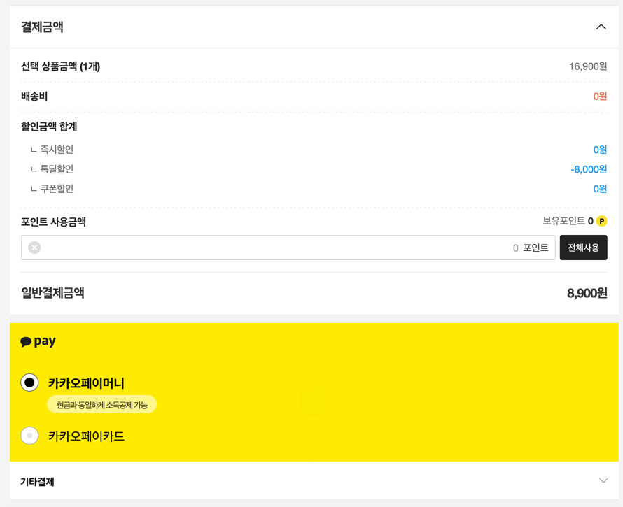

    - 기타결제 : 아코디언으로 접혀 있음

      - 카드결제, 유대폰 결제, 무통장입금을 콤포박스로 선택 가능
      - 무통장입금의 경우 은행을 드롭다운으로 선택할 수 있음

      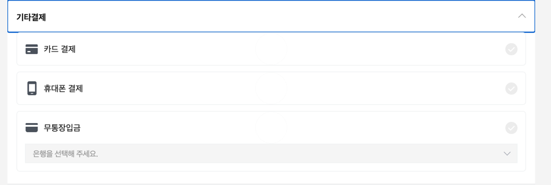

  - 정보이용 동의 : 체크박스로 동의 가능
    - 링크를 통해 자세한 내용 확인 가능
    - 동의하지 않은 경우 주문 불가능
    - 전체 동의하기를 통해 모든 체크박스 체크 가능

  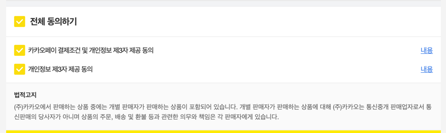

7. 주문 내역 페이지

- 핵심 기능 : 주문 내역을 보여줍니다.
- 기능 상세 설명 : 주문 내역을 클릭하면 주문 상세 내역을 볼 수 있습니다.
- 인터페이스 요구 사항 : 주문 내역은 주문 날짜별로 나열되어 있음

  - 주문 내역 : 주문 날짜, 주문 번호, 주문 상품, 주문 금액, 주문 상태를 보여줌
  - 주문 상세 내역 : 주문 상품, 주문 금액, 주문 상태, 주문자 정보, 배송지 정보, 결제 정보를 보여줌
  - 버튼을 통해 배송 상태에 따른 상품 확인 가능

    - 전체, 배송/발송대기, 배송/발송진행, 취소/교환/환불, 구매결정

    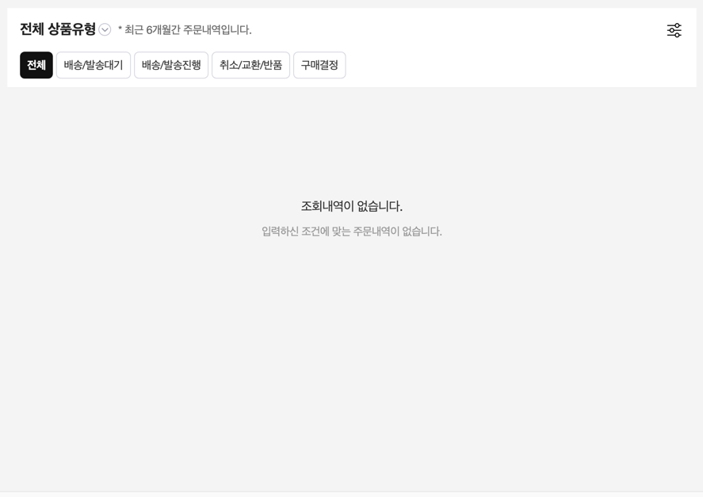
    </br>

## 2. 디렉터리 구조

```
step2-FE-kakao-shop
- my-kakao-shop
  - public
  - src
    - components
    - images
```
