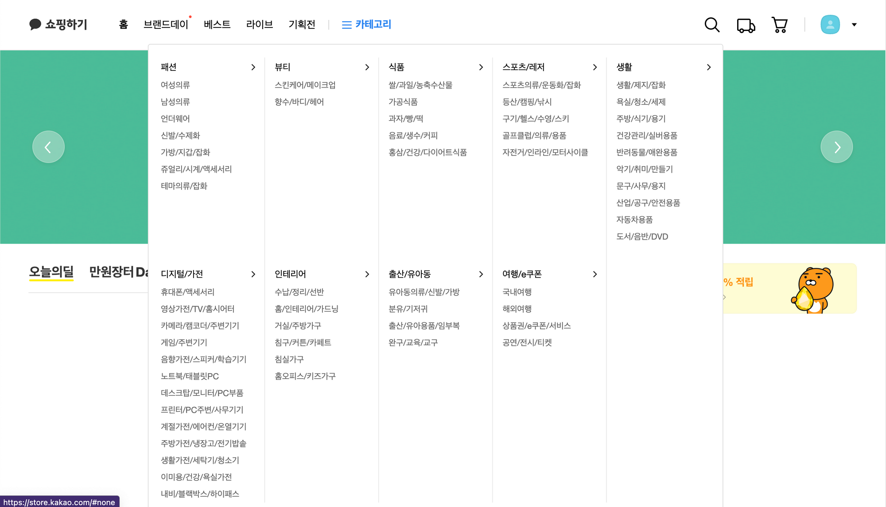
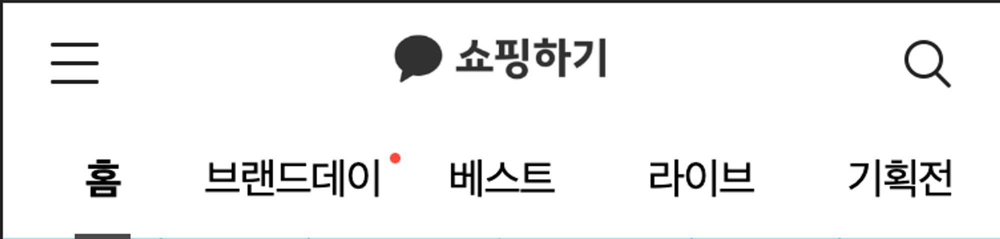
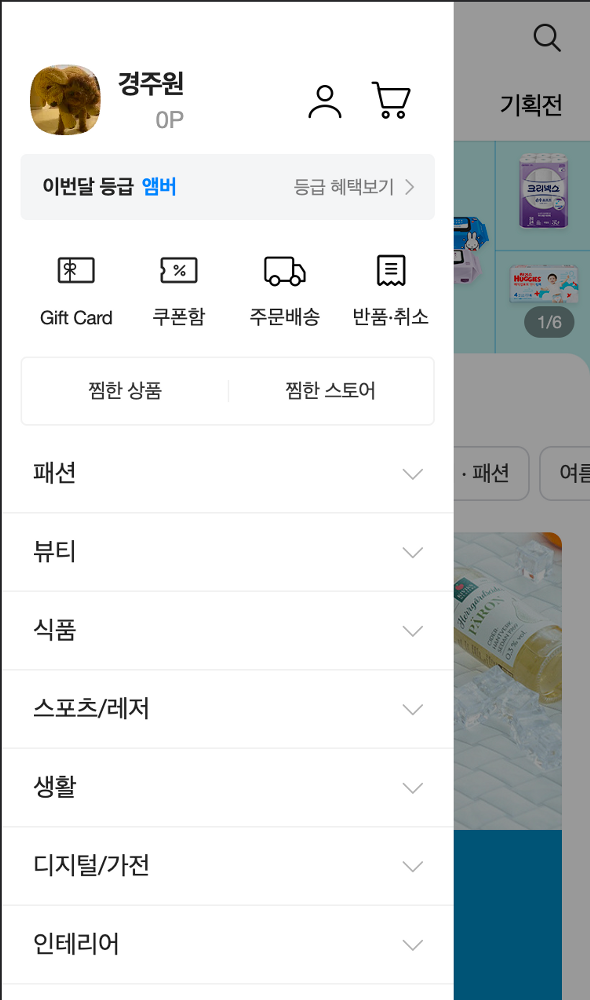
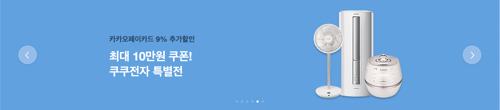
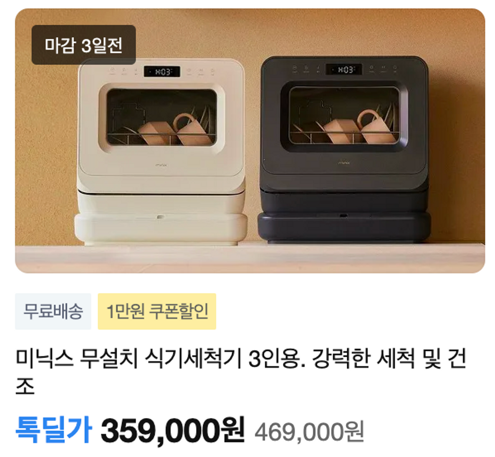
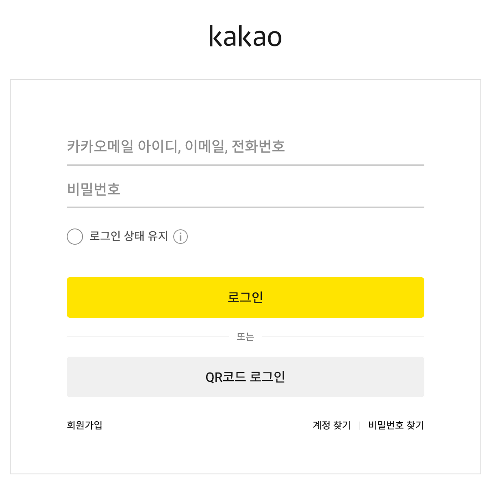
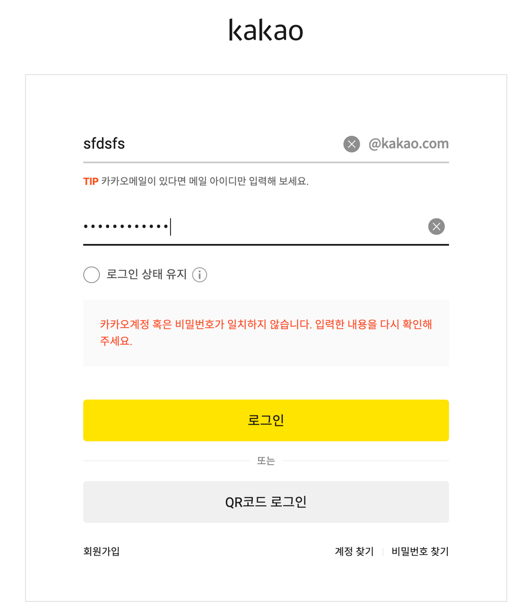
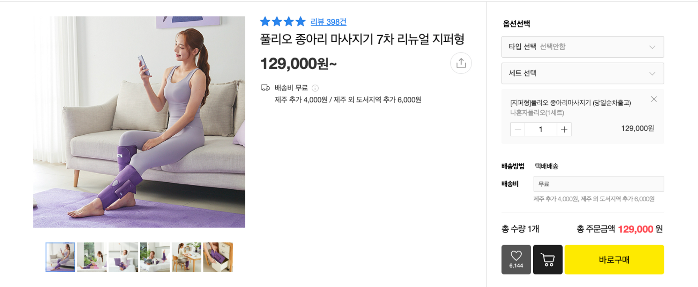
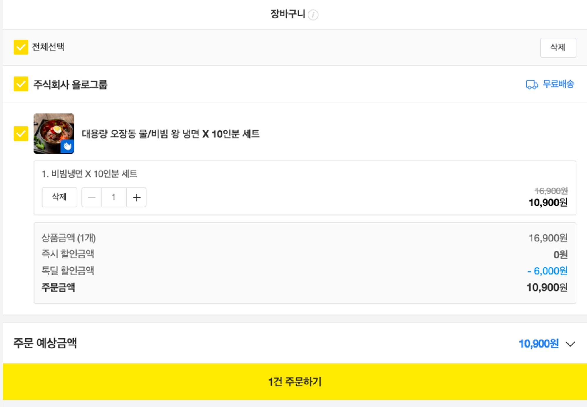
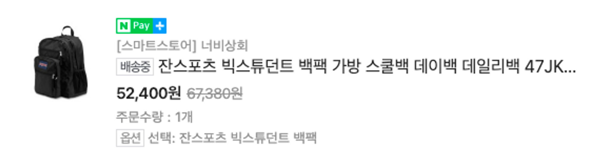

# 페이지별 구성

✅ [카카오톡 쇼핑하기](https://store.kakao.com/?__ld__=&oldRef=https:%2F%2Fbuy.kakao.com%2Fshopping-front%2Fstore%2Fcart%3Fchannel%3DSTORE)와 [api](http://kakao-app-env.eba-kfsgeb74.ap-northeast-2.elasticbeanstalk.com/docs/api-docs.html) 문서를 참고해 페이지를 구성한다

api 기능은 다음과 같다.

- 전체 상품 목록 조회
- 개별 상품 상세 조회
- 이메일 중복 체크
- 회원가입
- 로그인
- 장바구니 담기
- 장바구니 수정
- 주문하기
- 주문 결과 확인

## 공통 인터페이스

✅ 여러 페이지에서 재사용되는 인터페이스에 대한 요구사항을 정리한다

### 나비게이션 바

- 반응형으로 PC와 모바일에서 다르게 나타난다
- 버튼을 통해 프로젝트 내 다른 페이지를 이동한다
    - 검색하기, 구매목록, 장바구니, 프로필, 로그인
    - 로그인을 하지 않았을 경우 프로필 버튼 대신 로그인 버튼이 나타난다# 페이지별 구성

✅ 카카오톡 쇼핑하기와 api 문서를 참고해 페이지를 구성한다

api 기능은 다음과 같다.

- 전체 상품 목록 조회
- 개별 상품 상세 조회
- 이메일 중복 체크
- 회원가입
- 로그인
- 장바구니 담기
- 장바구니 수정
- 주문하기
- 주문 결과 확인

## 공통 인터페이스

✅ 여러 페이지에서 재사용되는 인터페이스에 대한 요구사항을 정리한다

### 나비게이션 바

- 반응형으로 PC와 모바일에서 다르게 나타난다
- 버튼을 통해 프로젝트 내 다른 페이지를 이동한다
    - 검색하기, 구매목록, 장바구니, 프로필, 로그인
    - 로그인을 하지 않았을 경우 프로필 버튼 대신 로그인 버튼이 나타난다
    - 로그인을 하지 않았을 경우 구매목록, 장바구니 페이지 접근을 막는다
- 모바일에서는 사이드바를 활용한다.
1. PC

   
   
    - 이동할 수 있는 페이지

2.mobile
    

## 메인 페이지

### 핵심 기능

- 전체 상품 목록 조회

### 기능 상세 설명

- 전체 상품 목록을 조회한다
    - 상품 id, 상품 이름, 상품 설명, 상품 이미지 url, 상품 가격

### 인터페이스 요구사항

1. carousel

    - 일정 시간에 따라 자동으로 slide가 변경된다
    - 좌우 버튼을 눌러 slide를 변경할 수 있다
    - 하단의 `indicators`를 통해 현재 활성화된 slide가 몇 번째 slide인지 알 수 있다

2. 상품 정보

    - `grid`를 활용해 페이지 너비에 따라 상품 정보 컴포넌트의 개수를 변경한다
    - 해당 컴포넌트가 `hover` 상태일 때 이미지가 부드럽게 확대된다
    - 해당 컴포넌트를 클릭할 시, 개별 상품 상세 페이지로 이동한다

## 로그인 페이지

### 핵심 기능

- 로그인 요청 및 사용자 로그인 정보 저장

### 기능 상세 설명

- 이메일과 비밀번호를 이용해 로그인을 한다
- 로그인이 성공할 시 jwt token을 localStorage에 저장한다

### 인터페이스 요구사항

- 로그인이 실패할 경우 마지막 input 하단에 에러에 대한 설명이 나타난다
- 입력한 값이 각 input에 대한 validation에 맞지 않을 때, 각 input 하단에 validation에 대한 설명이 나타난다. 또한 input 중 하나라도 validation에 어긋나면 로그인을 할 수 없다.
    - 이메일: 이메일 형식이 아닙니다
    - 비밀번호: 영문, 숫자, 특수문자가 포함되어야 합니다, 8~20자 이내여야 합니다
        - 공백 입력을 막는다
- 로그인이 성공하면 token을 localStorage에 저장한다
- 회원가입 버튼을 클릭하면 회원가입 페이지로 이동할 수 있다

## 회원가입 페이지

### 핵심 기능

- 회원가입

### 기능 상세 설명

- 이메일, 비밀번호, 사용자 이름을 이용해 회원가입한다
- 로그인이 성공할 시 jwt token을 localStorage에 저장한다

### 인터페이스 요구사항

- 이메일, 사용자 이름, 비밀번호를 input으로 입력받는다
    - 각 input은 validation 체크를 진행하고, validation에 어긋나면 각 input 하단에 validation에 대한 설명이 나타난다
    - 이메일: 이메일 형식이 아닙니다
    - 비밀번호: 영문, 숫자, 특수문자가 포함되어야 합니다, 8~20자 이내여야 합니다
        - 공백 입력을 막는다
- 이메일 input은 이메일 중복체크 api 통신 후 이메일이 중복된 경우 input 하단에 이메일 중복 여부를 나타낸다

## 개별 상품 상세 페이지

### 핵심 기능

- 개별 상품에 대한 상세한 정보 제공
- 상품 장바구니 저장 기능

### 기능 상세 설명

- 상품 이름, 상품 설명, 상품 이미지, 상품 가격, 별점, 옵션에 대한 정보가 제공된다
- 사용자는 옵션을 선택한 후 해당 상품을 장바구니에 저장할 수 있다

### 인터페이스 요구사항

- 옵션 선택은 하나만 할 수 있고 취소가 불가하다
- 선택한 옵션의 상품이 옵션 선택 아래 나타난다
- 선택한 옵션의 수량을 변경할 수 있다 (0으로 변경은 불가능)
- 장바구니 버튼을 통해 선택한 상품을 장바구니 담기 요청 후, 장바구니 페이지로 이동할 수 있다

## 장바구니 페이지

### 핵심 기능

- 장바구니에 있는 상품 조회 및 수정
- 장바구니에 있는 상품 주문하기

### 기능 상세 설명

- 장바구니에 있는 상품의 아이디, 상품 이름, 선택한 옵션, 수량, 개당 금액, 총 금액을 조회한다
- 장바구니에 있는 데이터를 선택 삭제 할 수 있다
- 장바구니에 있는 상품의 수량을 변경할 수 있다

### 인터페이스 요구사항

- 위의 사진은 예시일 뿐 checkbox는 사용하지 않는다
    - api 명세서에 따르면 장바구니에 있는 상품 중 선택 후 주문 기능이 없음
- 삭제 및 수량 수정 버튼을 통해 장바구니 update 가능
    - 수량은 0이 될 수 없으며 수량이 1일 때 -(마이너스) 버튼은 비활성화된다
- 주문하기 버튼을 통해 현재 장바구니에 있는 모든 상품을 주문 요청을 보낸 후, 성공할 경우 주문 완료 페이지로 이동한다

## 개별 주문 완료 페이지

### 핵심 기능

- 주문 결과 조회

### 기능 상세 설명

- 주문한 상품의 상품 이름, 옵션, 수량, 개당 금액, 총 금액을 조회한다

### 인터페이스 요구사항

- 상품 정보를 클릭하면 개별 상품 상세 페이지로 이동한다

## 주문 목록 페이지

### 핵심 기능

- 주문 목록 조회

### 기능 상세 설명

- 모든 주문의 결제일, 상품 이름, 총 금액을 조회한다

### 인터페이스 요구사항

- 결제상세 버튼을 클릭하면 개별 주문 완료 페이지로 이동한다

# 디렉토리 구조
src 내부 디렉토리
- pages: 페이지
- components: 컴포넌트
- hooks: 커스텀 훅
- constant: 상수
- utils: 유틸 함수
- api: api 관련 함수
- styles: style 관련
- assets: 이미지와 같은 정적 파일
- recoil: 상태 관리 관련 (recoil)
- App.js: 리액트 Root (라우터)
- index.js: 코드 진입

      - 로그인을 하지 않았을 경우 구매목록, 장바구니 페이지 접근을 막는다
- 모바일에서는 사이드바를 활용한다.
1. PC

   

   

    - 이동할 수 있는 페이지
2. mobile

   

   

## 메인 페이지

### 핵심 기능

- 전체 상품 목록 조회

### 기능 상세 설명

- 전체 상품 목록을 조회한다
    - 상품 id, 상품 이름, 상품 설명, 상품 이미지 url, 상품 가격

### 인터페이스 요구사항

1. carousel

   

    - 일정 시간에 따라 자동으로 slide가 변경된다
    - 좌우 버튼을 눌러 slide를 변경할 수 있다
    - 하단의 `indicators`를 통해 현재 활성화된 slide가 몇 번째 slide인지 알 수 있다
2. 상품 정보

   

    - `grid`를 활용해 페이지 너비에 따라 상품 정보 컴포넌트의 개수를 변경한다
    - 해당 컴포넌트가 `hover` 상태일 때 이미지가 부드럽게 확대된다
    - 해당 컴포넌트를 클릭할 시, 개별 상품 상세 페이지로 이동한다

## 로그인 페이지

### 핵심 기능

- 로그인 요청 및 사용자 로그인 정보 저장

### 기능 상세 설명

- 이메일과 비밀번호를 이용해 로그인을 한다
- 로그인이 성공할 시 jwt token을 localStorage에 저장한다

### 인터페이스 요구사항

- 로그인이 실패할 경우 마지막 input 하단에 에러에 대한 설명이 나타난다
- 입력한 값이 각 input에 대한 validation에 맞지 않을 때, 각 input 하단에 validation에 대한 설명이 나타난다. 또한 input 중 하나라도 validation에 어긋나면 로그인을 할 수 없다.
    - 이메일: 이메일 형식이 아닙니다
    - 비밀번호: 영문, 숫자, 특수문자가 포함되어야 합니다, 8~20자 이내여야 합니다
        - 공백 입력을 막는다
- 로그인이 성공하면 token을 localStorage에 저장한다
- 회원가입 버튼을 클릭하면 회원가입 페이지로 이동할 수 있다

## 회원가입 페이지

### 핵심 기능

- 회원가입

### 기능 상세 설명

- 이메일, 비밀번호, 사용자 이름을 이용해 회원가입한다
- 로그인이 성공할 시 jwt token을 localStorage에 저장한다

### 인터페이스 요구사항

- 이메일, 사용자 이름, 비밀번호를 input으로 입력받는다
    - 각 input은 validation 체크를 진행하고, validation에 어긋나면 각 input 하단에 validation에 대한 설명이 나타난다
    - 이메일: 이메일 형식이 아닙니다
    - 비밀번호: 영문, 숫자, 특수문자가 포함되어야 합니다, 8~20자 이내여야 합니다
        - 공백 입력을 막는다
- 이메일 input은 이메일 중복체크 api 통신 후 이메일이 중복된 경우 input 하단에 이메일 중복 여부를 나타낸다

## 개별 상품 상세 페이지

### 핵심 기능

- 개별 상품에 대한 상세한 정보 제공
- 상품 장바구니 저장 기능

### 기능 상세 설명

- 상품 이름, 상품 설명, 상품 이미지, 상품 가격, 별점, 옵션에 대한 정보가 제공된다
- 사용자는 옵션을 선택한 후 해당 상품을 장바구니에 저장할 수 있다

### 인터페이스 요구사항

- 옵션 선택은 하나만 할 수 있고 취소가 불가하다
- 선택한 옵션의 상품이 옵션 선택 아래 나타난다
- 선택한 옵션의 수량을 변경할 수 있다 (0으로 변경은 불가능)
- 장바구니 버튼을 통해 선택한 상품을 장바구니 담기 요청 후, 장바구니 페이지로 이동할 수 있다

## 장바구니 페이지

### 핵심 기능

- 장바구니에 있는 상품 조회 및 수정
- 장바구니에 있는 상품 주문하기

### 기능 상세 설명

- 장바구니에 있는 상품의 아이디, 상품 이름, 선택한 옵션, 수량, 개당 금액, 총 금액을 조회한다
- 장바구니에 있는 데이터를 선택 삭제 할 수 있다
- 장바구니에 있는 상품의 수량을 변경할 수 있다

### 인터페이스 요구사항

- 위의 사진은 예시일 뿐 checkbox는 사용하지 않는다
    - api 명세서에 따르면 장바구니에 있는 상품 중 선택 후 주문 기능이 없음
- 삭제 및 수량 수정 버튼을 통해 장바구니 update 가능
    - 수량은 0이 될 수 없으며 수량이 1일 때 -(마이너스) 버튼은 비활성화된다
- 주문하기 버튼을 통해 현재 장바구니에 있는 모든 상품을 주문 요청을 보낸 후, 성공할 경우 주문 완료 페이지로 이동한다

## 개별 주문 완료 페이지

### 핵심 기능

- 주문 결과 조회

### 기능 상세 설명

- 주문한 상품의 상품 이름, 옵션, 수량, 개당 금액, 총 금액을 조회한다

### 인터페이스 요구사항

- 상품 정보를 클릭하면 개별 상품 상세 페이지로 이동한다

## 개별 주문 목록 페이지

### 핵심 기능

- 주문 목록 조회

### 기능 상세 설명

- 모든 주문의 결제일, 상품 이름, 총 금액을 조회한다

### 인터페이스 요구사항

- 결제상세 버튼을 클릭하면 주문 완료 페이지로 이동한다

# 디렉토리 구조
src 내부 디렉토리
- pages: 페이지
- components: 컴포넌트
- hooks: 커스텀 훅
- constant: 상수
- utils: 유틸 함수
- api: api 관련 함수
- styles: style 관련
- assets: 이미지와 같은 정적 파일
- recoil: 상태 관리 관련 (recoil)
- App.js: 리액트 Root (라우터)
- index.js: 코드 진입
